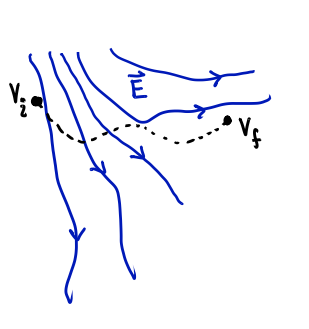
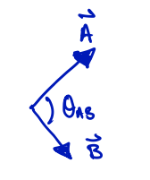
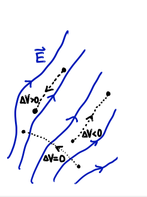
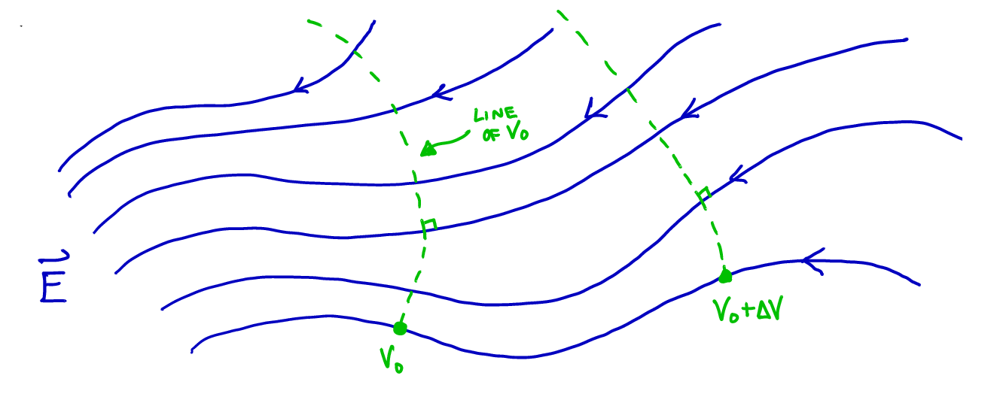
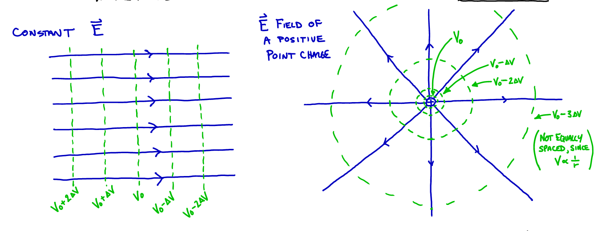

# Equipotential Surfaces and Capacitance

## Equipotential Surfaces

### Change in potential for region of uniform E field

Last time we defined the change in potential as
   ```math
   \Delta V = \frac{\Delta U_e}{q_{\text{test}}} = \frac{-W_e}{q_{\text{test}}}
   ```


Meaning that the change in potential from one point in an electric field to another is found by calculating the change in potential energy (U) when moving a test charge between those two points, and dividing by that charge.

The work is being done by the force of the electric field, $\vec{F}_e = q_e \vec{E}$, so we can write
```math
\begin{align}
\Delta V & = \frac{-W_e}{q_{\text{test}}} = \frac{-\vec{F}_e \cdot \Delta \vec{s}}{q_{\text{test}}} = \frac{-q_{\text{test}} \vec{E} \cdot \Delta \vec{s}}{q_{\text{test}}}\\
& \Rightarrow \Delta V = - \vec{E} \cdot \Delta \vec{s}
\end{align}
```
(For a uniform electric field, this is the same as our expression: $\Delta V = -Ed$)

### Dot/Scalar product of vectors, and consequences for $\Delta V$



Recall that the "dot product" is:
```math
\vec{A} \cdot \vec{B} = AB \cos \theta_{AB}
```
Meaning that it is:

- Positive when $\vec{A}$ & $\vec{B}$ in "same direction" ($0 \leq \theta_{AB} < 90^\circ$)
- Zero when $\vec{A} \perp \vec{B}$ ($\theta_{AB} = 90^\circ$)
- Negative when $\vec{A}$ & $\vec{B}$ point in "opposite dir." ($90^\circ < \theta_{AB} \leq 180^\circ$)



So, the change in potential, $\Delta V$, is:

- Negative when moving along the E-field lines
- Zero when moving perpendicular to the E-field
- Positive when moving against the E-field lines

### Equipotential lines on electric fields

So, at any point in an electric field one can trace out a line (or surface, in 3D) of constant potential by moving perpendicular to the field lines



Using lines of constant potential separated by equal intervals $\Delta V$, we can construct a contour map



### Getting $\vec{E}$ field from $V$

In fact, given a contour map of the potential, we can reconstruct the electric field using two rules:

1. The electric field magnitude at a point is given by the change in potential with distance:
```math
E = \frac{\Delta V}{\Delta r_{max}}
```
where $\Delta r_{max}$ is a displacement in the direction of maximum change of $V$ (increasing $V$).

2. The direction of the electric field is opposite to the direction of maximum change in $V$ at that point.

In math, this is called "The Gradient"
```math
\vec{E} = -\nabla V
```
