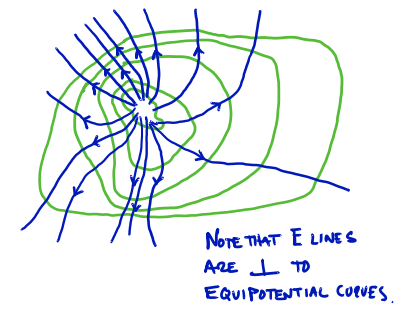
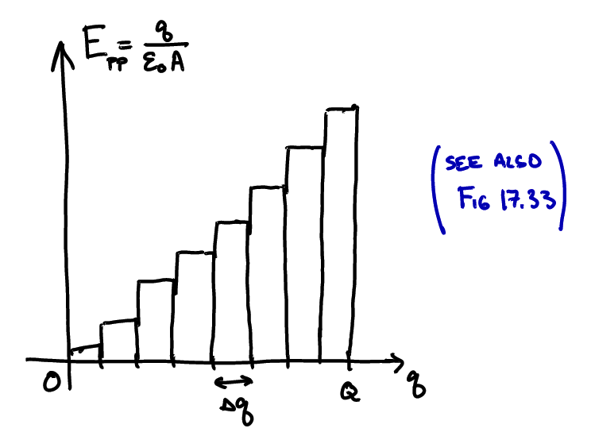

# Equipotential Surfaces and Capacitance

## Equipotential Surfaces

### Change in potential for region of uniform E field

Last time we defined the change in potential as
   ```math
   \Delta V = \frac{\Delta U_e}{q_{\text{test}}} = \frac{-W_e}{q_{\text{test}}}
   ```


Meaning that the change in potential from one point in an electric field to another is found by calculating the change in potential energy (U) when moving a test charge between those two points, and dividing by that charge.

The work is being done by the force of the electric field, $\vec{F}_e = q_e \vec{E}$, so we can write
```math
\begin{align}
\Delta V & = \frac{-W_e}{q_{\text{test}}} = \frac{-\vec{F}_e \cdot \Delta \vec{s}}{q_{\text{test}}} = \frac{-q_{\text{test}} \vec{E} \cdot \Delta \vec{s}}{q_{\text{test}}}\\
& \Rightarrow \Delta V = - \vec{E} \cdot \Delta \vec{s}
\end{align}
```
(For a uniform electric field, this is the same as our expression: $\Delta V = -Ed$)

### Dot/Scalar product of vectors, and consequences for $\Delta V$


Recall that the "dot product" is:
```math
\vec{A} \cdot \vec{B} = AB \cos \theta_{AB}
```
Meaning that it is:

- Positive when $\vec{A}$ & $\vec{B}$ in "same direction" ($0 \leq \theta_{AB} < 90^\circ$)
- Zero when $\vec{A} \perp \vec{B}$ ($\theta_{AB} = 90^\circ$)
- Negative when $\vec{A}$ & $\vec{B}$ point in "opposite dir." ($90^\circ < \theta_{AB} \leq 180^\circ$)


So, the change in potential, $\Delta V$, is:

- Negative when moving along the E-field lines
- Zero when moving perpendicular to the E-field
- Positive when moving against the E-field lines

### Equipotential lines on electric fields

So, at any point in an electric field one can trace out a line (or surface, in 3D) of constant potential by moving perpendicular to the field lines


Using lines of constant potential separated by equal intervals $\Delta V$, we can construct a **contour map**


### Getting $\vec{E}$ field from $V$

In fact, given a contour map of the potential, we can *reconstruct the electric field* using two rules:

1. The electric field *magnitude* at a point is given by the change in potential with distance:
```math
E = \frac{\Delta V}{\Delta r_{max}}
```
where $\Delta r_{max}$ is a displacement in the direction of maximum change of $V$ (increasing $V$).

2. The *direction* of the electric field is opposite to the direction of maximum change in $V$ at that point.

In math, this is called "The Gradient"
```math
\vec{E} = -\nabla V
```

### Example: Sketch the electric field corresponding to the potential contour map


Sketching the electric field *vectors* at a few points in space:


Drawing the electric *field lines* for all points in space (recall: (i) lines are closer together where field is stronger, and (ii) the field lines are always parallel to the field vectors.



We see, then, that the (scalar) potential field is an alternative way to represent a (vector) electric field.

### Conductors in electrostatic equilibrium


For a **conductor in equilibrium** (charges are not accelerating), we stated previously that the electric field was (i) zero inside the conductor and (ii) perpendicular to its surface. This means that the *entire conductor* (interior and surface) *is an equipotential surface*.  Since
```math
V = \text{const.} \quad \rightarrow \quad \frac{\Delta V}{\Delta r} = 0 \quad \rightarrow \quad E = 0
```

## Capacitors

### Overview

A **capacitor** is a tool for storing energy in a static electric field, when charged, it consists of two equally but oppositely-charged conductors and an electric field which connects them.


A capacitor can be **charged** by connecting the two conductors to opposite poles (or terminals) of a battery (a device that maintains a constant potential difference, $\Delta V$, between its poles ... more soon!)


The charge acquired by each conductor is proportional to the applied potential difference, $\Delta V$:
```math
Q = C \Delta V
```
The constant of proportionality, $C$, is called the **capacitance** of the capacitor. This can be calculated from the charge and pot. diff. ($C = Q/\Delta V$) but the constant depends only on the properties of the capacitor itself.

### Parallel-plate capacitor

The most common type of capacitor is the **Parallel-Plate Capacitor**: Two conducting plates of area $ A $, separated by a distance $ d $.


We already know that the (near) uniform field between the plates is:
```math
E_{pp} = \frac{\sigma}{\varepsilon_0} = \frac{Q}{\varepsilon_0 A}
```

And the change in potential along a constant $ E $ field is
```math
\Delta V = -Ed
```

So, the **capacitance of a parallel plate capacitor** is:
```math
C_{pp} = \frac{Q}{\Delta V} = \frac{E_{pp} \varepsilon_0 A}{E_{pp} d} = \frac{\varepsilon_0 A}{d} \implies C_{pp} = \frac{\varepsilon_0 A}{d}
```

Note that this expression does not depend on $E$, $Q$, or $\Delta V$, only on the physical properties of the capacitor (and the constant $\varepsilon_0 = \frac{1}{4\pi k}$).

### Simple circuit with a capacitor

When we connect a capacitor to a battery, it is a type of **circuit** (much more later). When drawing circuits, a capacitor is represented by  and a battery by . Wires are represented by lines.


Once charged, the value of the potential on each plate is that of the battery terminal it is connected to, so we could say the top half is at $V_+$ and the bottom is at $V_-$.

While charging, the story is complicated; we will talk a bit about this w/ "RC circuits".

### Capacitors in Parallel

When two or more capacitors are connected across the same potential difference, they are said to be "connected in parallel".


For a collection of capacitors, it will be useful to determine their **equivalent capacitance**, meaning the capacitance of a replacement capacitor which would change nothing about the circuit.


If the battery "sees" the same charge on the equivalent capacitor that it does on the capacitors in parallel,


Then it must be true that:
```math
Q = Q_1 + Q_2 + Q_3
```
and, using the def'n of capacitance,
```math
\begin{align}
C_{eq}\Delta V & = C_1\Delta V_1 + C_2\Delta V_2 + C_3\Delta V_3 \\
C_{eq}\Delta V &= C_1\Delta V + C_2\Delta V + C_3\Delta V
\end{align}
```
dividing off $\Delta V$
```math
C_{eq} = C_1 + C_2 + C_3 \quad \text{capacitors in parallel}
```

### Capacitors in Series

When two or more capacitors are connected in a line such that the potential difference across the whole set is equal to the sum of the potential differences across each capacitor, then are said to be "connected in series."


Before trying to find the equivalent capacitance for capacitors in series, we should note something about the charge on each!


So, to find the equivalent capacitance, we write
```math
\Delta V = \Delta V_1 + \Delta V_2 + \Delta V_3
```
using the definition of capacitance:
```math
\frac{Q}{C_{eq}} = \frac{Q_1}{C_1} + \frac{Q_2}{C_2} + \frac{Q_3}{C_3}
```
and assuming same charge,
```math
Q = \frac{Q}{C_{eq}} = \frac{Q}{C_1} + \frac{Q}{C_2} + \frac{Q}{C_3}
```
and dividing off $Q$,
```math
\frac{1}{C_{eq}} = \frac{1}{C_1} + \frac{1}{C_2} + \frac{1}{C_3} \quad \text{capacitors in series}
```

### Energy Stored in a Capacitor

The energy stored in a capacitor is the work required to rearrange the configuration of charges.


If a capacitor already has a stored charge $Q_i$, the work done by the electric field when an additional $\Delta Q$ is moved is:
```math
W_{F_{\text{elec}}} = \vec{F} \cdot \vec{d} = -E \Delta Qd
```
So the change in potential energy (stored energy in the capacitor) is:
```math
\Delta U = -W_{F_{\text{elec}}} = + \Delta Q E d = \Delta Q \Delta V
```

As charges are added, the electric field strength increases so our "work done by a constant force" rule can only be applied to small chunks of charge (i.e., we can not say that $U=\frac{1}{2}Q\Delta V$).

So we must calculate the work done by summing over small $\Delta Q$ ("integrating") and we find that:
```math
W_{F_{\text{elec}}} = -\left(\sum_{i=1}^{n} \Delta Q E(i)\right) d = -\frac{Q \Delta V}{2}
```



The potential energy stored in a capacitor is therefore:
```math
  U = \frac{1}{2} Q \Delta V
```
where $Q$ is the total charge on one plate and $\Delta V$ is the potential difference across the plates. Using $Q = C\Delta V$ we could also write:
```math
U = \frac{1}{2} C (\Delta V)^2 = \frac{Q^2}{2C}
```

Note that the capacitance, $C$, limits the energy stored for a given $\Delta V$. This can be increased by inserting a dielectric between the plates...
