CURRENT, RESISTANCE, AND OHM'S LAW
==================================

Current
-------

Electrical circuits --- lighting our homes, powering our phones, and controlling our own thoughts and actions in neural networks --- are driven by moving charge.

Consider an electric field passing through a metal cylinder:

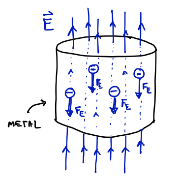

- Free electrons will feel a force (opposite to the direction of $\vec{E}$, since $q_e = -e$)

- If the cylinder is allowed to come to equilibrium, the electrons will arrange themselves such that the electric field inside the conductor is zero (the "static" or equilibrium case we have already discussed) with a build-up of negative charge on the bottom.

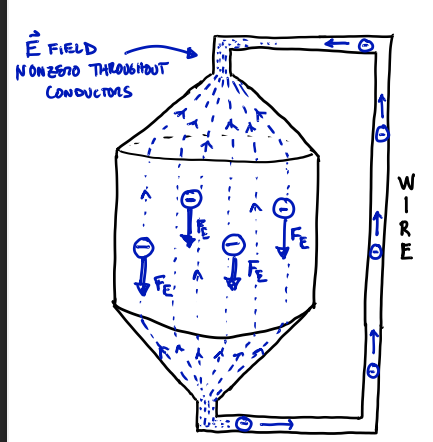

- If, however, another conductor (a wire) is attached, connecting the two ends of the cylinder, then the system will *not* come to equilibrium and electrons will flow in a loop or circuit.

- The flow rate of charge going past any cross-section of the conductor is called the **current**.

Since there is a force, $\vec{F}_E$, on the electrons, one might think that they accelerate (moving faster and faster around the circuit. In fact, they do not:

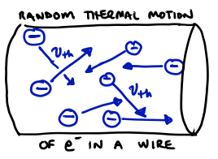

- At any nonzero temperature ($T>0$ K), the primary motion of electrons is *thermal*: fast and randomly-directed ($v_\text{th} \sim 10^5$ at room temperature).

- Electrons ove a very short distance before *colliding* with the metal's lattice of nuclei.

The electric force on free electrons in a conductor serves to change the thermal velocities very slightly, causing a small drift velocity, $v_d$, of electrons in the direction of the force.

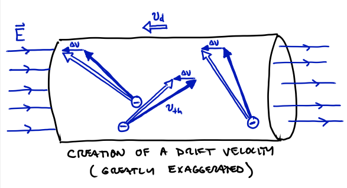

- The drift velocity, even for large currents is very small: $v_d \sim 10^{-5}$ m/s $\ll v_\text{th} \sim 10^5$ m/s.

- Question: What is $v_d$ in cm/h?

Definitions of Current (I), Current Density (Jvec), and Resistivity (rho)
------------------------------------------------------------------------

**Def'n**: Take a long conductor (call it a "wire") with an electric field directed along its length, and consider any cross-sectional area of the wire, $A$. The **current passing through $A$** is:
```math
I = \frac{\text{Net charge passing through $A$ in $\Delta t$}}{\Delta t}
```
The *direction* of the current is the direction of $\vec{E}$, i.e., the direction that positive charge carriers would flow. Given the presence of $\vec{E}$, positive charges will flow in one direction across $A$, and negative charge carriers will flow in the other direction.  Both of those will be considered a current in the direction of $\vec{E}$.  An equal amount of positive and negative charges passing the same way through A would yield a net charge flux of zero and therefore a zero current.  Although we give it a direction, the current, $I$, is not a vector.

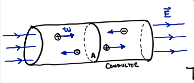

Examples:

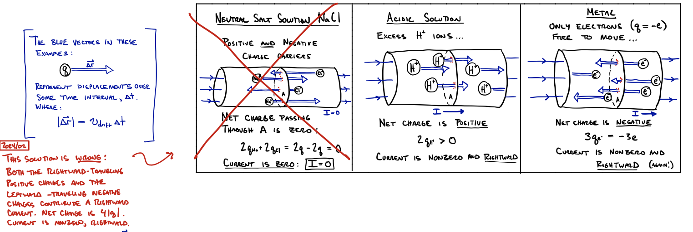

If we simplify to a single charge, $q$, with drift velocity, $v_d$, we can write the current as:
```math
\begin{align}
I &= \frac{|Q_\text{through A in $\Delta t$|}|}{\Delta t} = \frac{|q| N_\text{through A in $\Delta t$}}{\Delta t} = \frac{|q| n V_\text{through A in $\Delta t$}}{\Delta t} = \frac{|q| n A \Delta x_\text{in $\Delta t$}}{\Delta t} \\
& \rightarrow I = |q| n A v_d
\end{align}
```
where $n$ is the number of charge carriers per unit volume (called the *number density*, with $[n] = \text{m}^{-3}$).

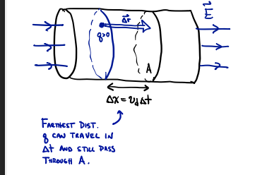

**Def'n**: Given an arbitrary conductor (no longer restricting ourselves to a "wire") with a penetrating electric field, $\vec{E}(\vec{r})$, one can imagine there will be a corresponding drift velocity field, $\vec{v}_d(\vec{r})$, meaning that, at every point $\vec{r}$, the charge carriers in that vicinity (let's assume a single type of charge carrier, with charge $q$) have an average drift velocity vector $\vec{v}_d$.  We can therefore define the **current density field**, $\vec{J}(\vec{r})$, as the current per unit area ($|\vec{J}| = I/A$) at every point:
```math
\vec{J}(\vec{r}) := q n \vec{v}_d(\vec{r}).
```
Since, for positive charge carriers, the drift velocity points in the same direction as $\vec{E}$, we can write this as
```math
\vec{J} = \sigma \vec{E} = (1/\rho) \vec{E}
```
where we have defined $\sigma$ as the **conductivity** of the material and $\rho$ as the **resistivity** (the inverse of the conductivity). Note that neither of these are "charge densities" (like we saw a few units ago), they just use the same symbol. The equation above is the most basic expression of "Ohm's Law" (see below).

We will primarily use the current, $I$, rather than the current density, $\vec{J}$. They are related by:
```math
I = \int_S \vec{J} \cdot d\vec{A} = \int_S \vec{J} \cdot \hat{n} dA
```
meaning that the current is the flux of the current density through a chosen surface, $S$.

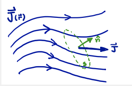


"Electromotive Force" (EMF) and Batteries
------------------------------------------------------------------------

The electric field that drives current in a circuit is usually creeated by a **battery**, an object with is able to maintain a constant potential difference between its two terminals:

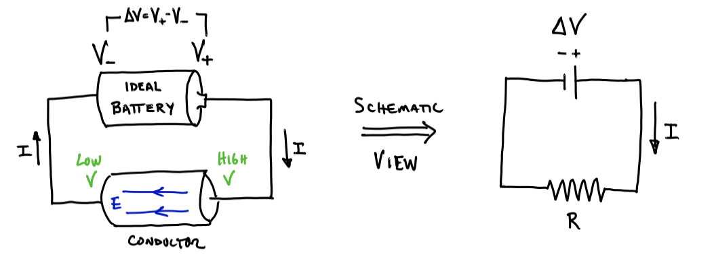

Any device that can maintain a constant potential difference across two points (a **battery** does this with a chemical reaction, a **generator** does it by converting mechanical energy to electrical) is called a *source of electromotive force* (EMF).  This is represented in a circuit schematic as


and the following variables are used interchangably to represent the value of the potential difference
```math
\Delta V \text{ ``potential diff"} \quad \leftrightarrow  V \text{ ``voltage"} \quad \leftrightarrow \mathcal{E} \text{ ``EMF"}
```
(Note that $V$ is used as both a variable (for "voltage", which means $\Delta V$) and as a unit, V for "volt", the SI unit of potential difference: $1 \text{ V}=\frac{\text{Nm}}{\text{C}} = \frac{\text{J}}{\text{C}}$.

An **ideal battery** is a pure source of EMF. **Real batteries**, however, cannot maintain a constant $\Delta V$ due to their "internal resistance" (see below).


Ohm's Law and Resistance
------------------------------------------------------------------------

When a potential difference is applied to a conductor, a current will flow.  For many materials --- so-called "ohmic materials" --- the current is proportional to the applied potential difference
```math
I \propto \Delta V
```

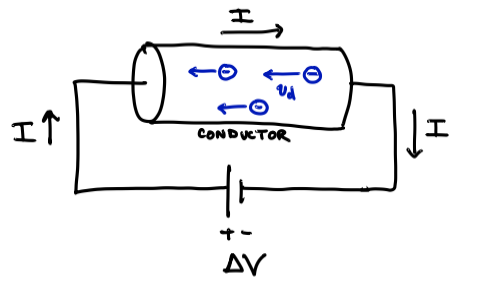

The constant of proportionality defines the **resistance**, R, of the conductor:
```math
I = \left( \frac{1}{R} \right) \Delta V \quad \text{or} \quad \Delta V_R = I R
```
where by $\Delta V_R$ we mean "the potential difference across *the* resistor with resistance $R$".

We can rewrite Ohm's law as an experimental definition of resistance (apply a potential difference and measure the resulting current):
```math
R := \frac{\Delta V_\text{applied}}{I_\text{measured}} \quad \rightarrow [R] = \frac{[\Delta V]}{[I]} = \frac{V}{A} = \Omega = \text{ ``ohm"}
```
where an "ohm", a volt per amp, is the SI unit of resistance.

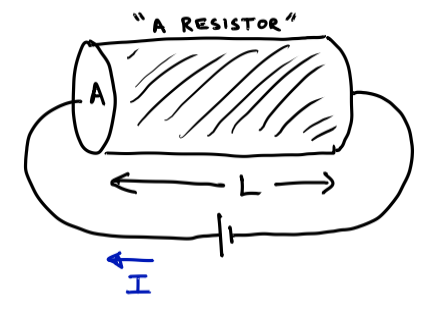


The resistance of an object depends on the properties of the material and the geometry:
```math
\begin{align}
R & \propto L \quad \text{longer object means higher $R$}\\
R & \propto \frac{1}{A} \quad \text{larger crossectional area means more routes for current flow}
\end{align}
```
so
```math
R  = \rho \frac{L}{A}
```
where the constant of proportionality, $\rho$, is called the **resistivity** of the material.  (Again, $\rho$ here has no connection to volume charge density).

A Simple Circuit
------------------------------------------------------------------------

When a resistor, $R$, is connected to an ideal battery with EMF $\mathcal{E}$, current will flow from the high potential terminal to the low potential terminal with $I = \mathcal{E}/R$.

- Rule: The *current* must be the same at all points on the loop or else there would be build-up of charge.

- Rule: The *electric potential* value changes when passing across elements of the circuit, but has the same value along all connected wires.

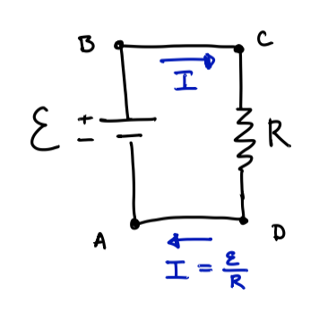

- The battery raises the potential by $\mathcal{E}$ (potential differece $\Delta V_\text{batt} = V_B - V_A = \mathcal{E}$. So the current passing across a resistor must cause a *drop* in potential by the same amount ($V_D - V_C = - \mathcal{E} = -IR$) to return $V_D = V_A$.

A **real battery** can be represented by an ideal battery (a source of constant EMF/$\Delta V$) in series with an **internal resistance** (a resistance of the battery itself, which cannot be physically separated).  The internal resistance, by Ohm's law, causes a drop in potential such that the **terminal voltage** (the potential difference across the terminals of the real battery, crossing both the EMF and internal resistor) is less than $\mathcal{E}$.

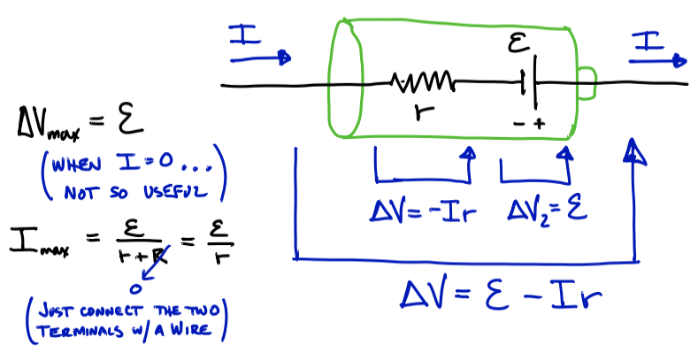

An ideal battery could put out any current: as the resistance across approaches zero, the current approches infinity!  But the internal resistance limits the maximum current of a real battery.

The potential difference at different points in a single circuit can be graphed to show the raise in potential across the battery, and the drop in potential across each resistor (when traveling in direction of current flow).


Energy in Electric Circuits
------------------------------------------------------------------------

# Energy supplied by a battery

A battery does work via a chemical force to "lift" charge to a higher potential energy.


- Without knowning the details of this "chemical force" we can see that the work it does is the opposite of the work done by the electric force over the same displacement ($\Delta \vec{s}$ on picture:
```math
W_\text{chemical} = - W_E = - \left( -\Delta U_E \right) = + q \Delta V
```
and writing $I = \frac{\Delta q}{\Delta t}$, or $\Delta q = I \Delta t$, we can see that the **average power** (the energy per time) **delivered by the battery** is:
```math
P_\text{batt} = \frac{W_\text{chemical}}{\Delta t} = \frac{\Delta q \Delta V_\text{batt}}{\Delta t} = I \Delta V_\text{batt} 
```
or, writing voltage as $V = \Delta V_\text{batt}$,
```math
P = I V
```
Recall from the first-semester physics class that the SI units of power are Joules per second or "Watts": $\text{W} = \frac{\text{J}}{\text{s}}$.

# Power dissipated in resistors

The energy supplied by a battery to a circuit is dissipated as heat in the resistor.  We can calculate:
```math
P_\text{dissipated} = P_\text{delivered} = I V = I\left( I R \right)
```
or
```math
P_\text{dissipated} = I^2 R = \frac{V^2}{R}
```
where we've again used Ohm's law in the last equality.

We could use this for a single resistor attached to an EMF:


But we could also apply it to a resistor within a more complicated circuit (next time!).

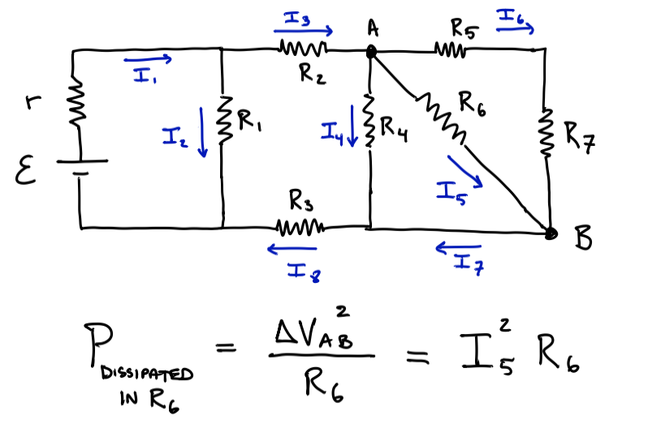