DC Circuits
===========

AC/DC (and "RC")
--------------------------------------------

Today we will discuss **"direct-current" (DC) circuits**. These are circuits powered by EMF devices providing a constant potential difference, such as a battery.  Once the battery (or batteries) is connected to the circuit (today: a system of resistors), the current in each wire will have a constant value and direction.  (By "each wire" we mean each juntionless wire; upon reaching a junction, the currents will split/add.) 

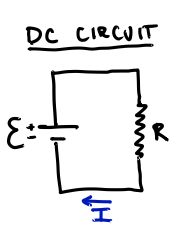

After studying magnetic fields, and magnetic induction in particular, we will see that it is often easier to produce an *alternating* source of EMF, where the value of the potential oscillates sinusoidally.  Attaching such a power source to a system of resistors (or other circuit elements) creates an **alternating-current (AC) circuit**.

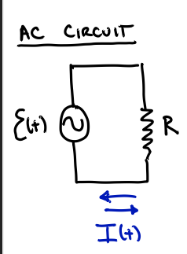

Next time we will consider a special case of DC circuits, those with resistors and capacitors: **RC Circuits**.  Since a capacitor is effectively a broken wire, current will be zero long after the battery is connected to such a circuit.  We will therefore be interested in the short-term behavior: charging (or dis-charging a capacitor).

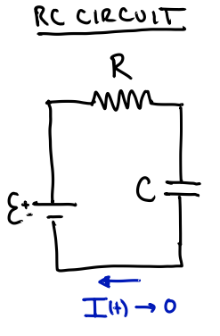

[RC circuits become more interesting when connected to an AC source, because then they are *constantly* charging and discharging.]

Potential and current in a DC circuit
--------------------------------------------

### Overview

To understand a circuit, one must determine:

1. The value of the potential at all points (relative to an arbitrary zero value, e.g., the "negative" terminal of the battery), and

2. The the value and directin of the current in each wire and/or circuit element.

**Potential**: The potential is *raised* when crossing a battery (from - to +), *remains the same* along wires (since $R_\text{wire} = 0$ and, by Ohm's Law, $\Delta V_\text{wire} = I R_\text{wire} = 0$), and *drops* across a resistor or capacitor (recall: $\Delta V_R = I R$ and $\Delta V_C = Q/C$).


**Current**: The current is the flow of charge past a point in the circuit, so --- like a fluid --- the current is *constant* at all points on a junctionless wire (a fluid flow is constant through a pipe, until that pipe splits).  And current *splits* or *merges* at a junction of wires.

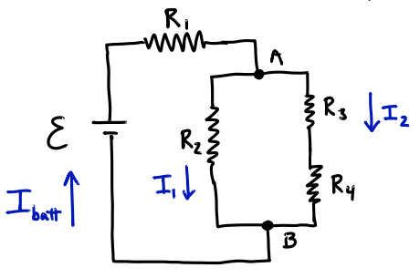

Note that, in the figure above:
- The current through the battery, $I_\text{batt}$, is the same as the current through $R_1$.
- At junction A, current splits such that $I_\text{batt} = I_1+ I_2$.
- The current through $R_3$ and $R_4$ is the same.
- At junction B, current merges.

### Kirchoff's Rules

The qualitative description of potential and current in the previous section can be summarized in two quantitative rules, called "Kirchoff's Rules":

1. **Loop Rule**: The sum of the changed in potential differences around any closed loop of wire is zero.

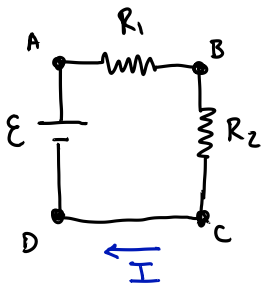

For the above circuit we can write:
```math
\begin{align}
\Delta V_\text{AB} + \Delta V_\text{BC} + \Delta V_\text{CD} + \Delta V_\text{DA} &= 0 \\
-I R_1 - I R_2 + 0 + \mathcal{E} &= 0
\end{align}
```
where (i) the potential drops across the resistors are negative because we have gone in the same direction as the current flow (A to B, and B to C), (ii) the potential difference across a bare wire is zero ($R_\text{wire}=0$), and (iii) the potential difference across a battery, when going from the low (-) to high (+) terminal, is positive.

2. **Junction Rule**: The sum of the currents into a junction of wires is zero (where we count "current in" as positive and "current out" of the junction as negative).  Alternatively, this could be stated as $I_\text{in} = I_\text{out}$.

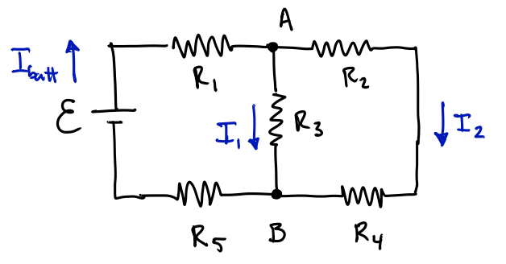

There are two junctions in the above circuit and both give the same equation.  At point A:

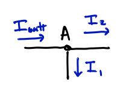

we have
```math
\begin{align}
I_\text{in} &= I_\text{out}\\
I_\text{batt} & = I_1 + I_2
\end{align}
```

And at point B:

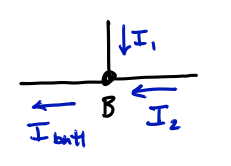

```math
\begin{align}
I_\text{in} &= I_\text{out}\\
I_1 + I_2 &= I_\text{batt}
\end{align}
```

Equivalent Resistance
--------------------------------------------

Just as for systems of capacitors, it will sometimes be useful to replace a collection of resistors with a single "equivalent resistor" (e.g., to find $I_\text{batt}$).

For a set of **resistors in series**, the resistors sum:
```math
R_\text{eq} = R_1 + R_2 + \cdots
```
And it is easy to see why this is true:

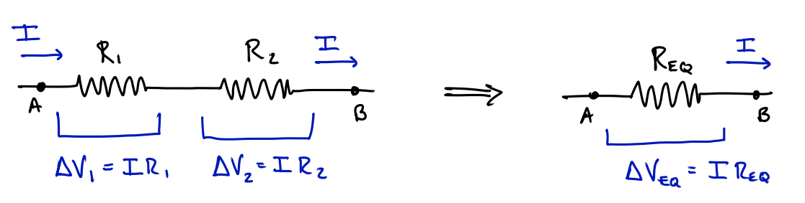

where
```math
\begin{align}
\Delta V_\text{AB} = \Delta V_1 + \Delta V_2 &= \Delta V_\text{eq}\\
I R_1 + I R_2 & = I R_\text{eq} \quad \rightarrow \quad R_\text{eq} = R_1 + R_2
\end{align}
```

For **resistors in parallel**, the potential difference across each is the same (the definition of "parallel"), but the current splits among them (not necessarily equally!).

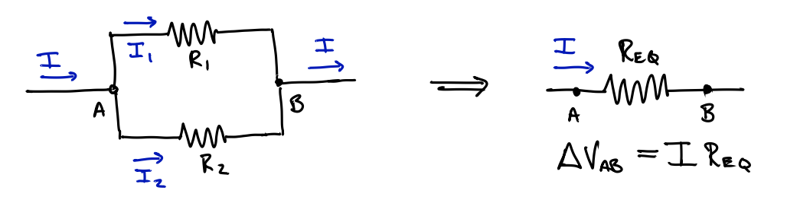

To find the equation for $R_\text{eq}$ in this case, start by applying the junction rule:
```math
I = I_1 + I_2
```
and then use Ohm's law on each term:
```math
\frac{\Delta V_\text{AB}}{R_\text{eq}} = \frac{\Delta V_1}{R_1} + \frac{\Delta V_2}{R_2} = \frac{\Delta V_\text{AB}}{R_1} + \frac{\Delta V_\text{AB}}{R_2} 
```
which yields
```math
\frac{1}{R_\text{eq}} = \frac{1}{R_1} + \frac{1}{R_2} + \cdots
```

Example: Equivalent Resistance
--------------------------------------------

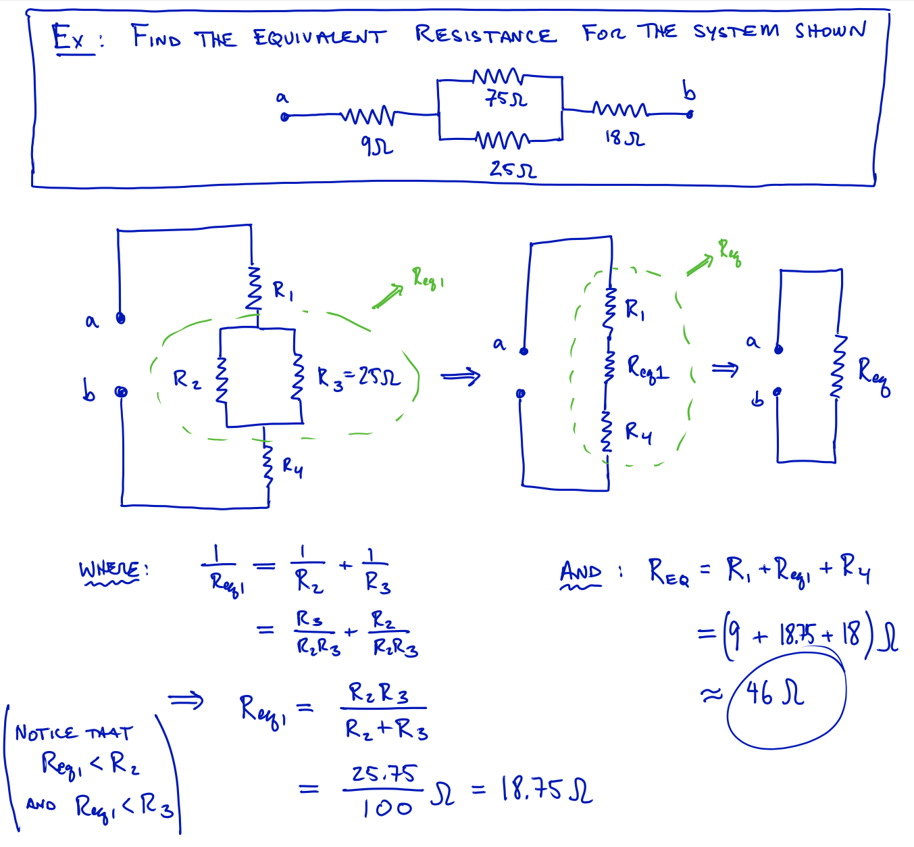

Application of Kirchoff's Rules
--------------------------------------------

### Overview

Sometimes we can take a complicated-looking circuit and use equivalent resistance to analyze it, e.g.,

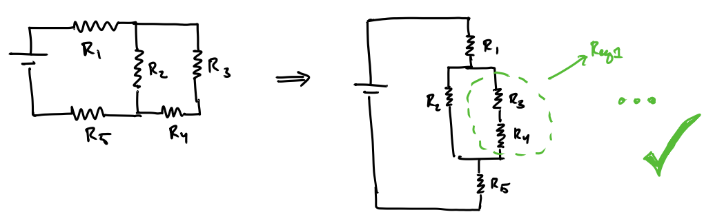

But other times, we definitely *cannot*:

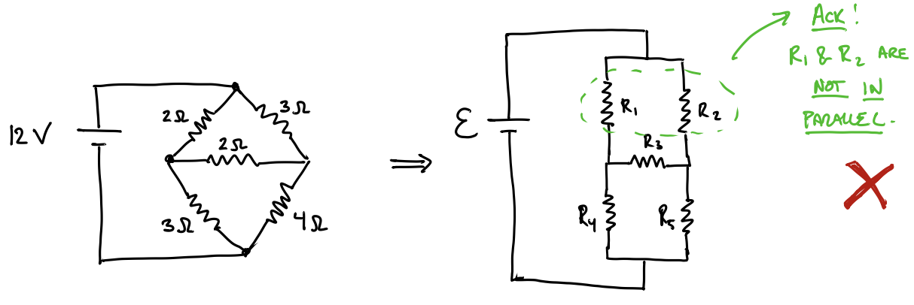

For these, more complicated, circuits, we need another way to solve (i.e., to determine all unknown quantities, like currents and potential differences).

### Algorithm for solving any DC circuit

1. Draw the circuit and give all batteries and resistors unique names (variables)

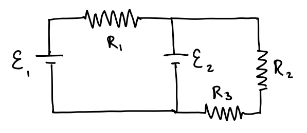

2. Assign a current to each wire and *assume a direction* for each (if your assumption is wrong, it's ok, you will just calculate a negative value for that current).

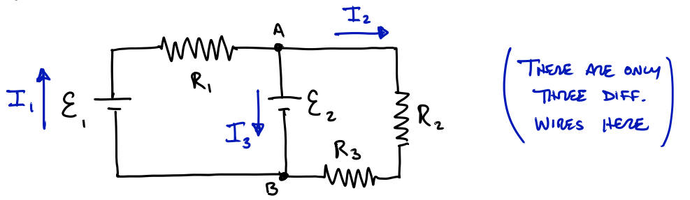

3. Write down the *junction rule(s)* and keep any unique equations (put a box around it). So for junction A, above, and using our assumed current directions, we find:
```math
I_\text{in} = I_\text{out} \quad \rightarrow \quad I_1 = I_2 + I_3
```

4. Choose a loop in the circuit: indicate its direction by drawing a loop with an arrow.  Then start at any point and write down the junction rule.  Where you follow these rules:

  - $\Delta V$ is positive going across a battery from low (-) to high (+)
  - $\Delta V$ is negative going across a battery from high to low
  - $\Delta V$ is negative going across a resistor *with the current*
  - $\Delta V$ is positive going across a resistor *against the current*

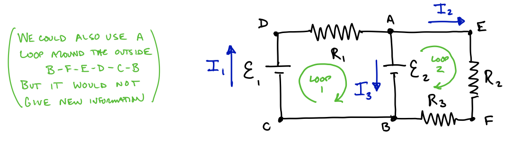

So for the above choices we have two loops and thus two junction rule equations. So for "Loop 1", we have (starting at point B and going clockwise):
```math
\begin{align}
\Delta V_\text{BC} + \Delta V_\text{CD} + \Delta V_\text{DA} + \Delta V_\text{AB} &= 0\\
0 + \mathcal{E}_1 - I_1 R_1 - \mathcal{E}_2 &= 0\\
\rightarrow \quad & \mathcal{E}_1 - \mathcal{E}_2 = I_1 R_1
\end{align}
```
and, for "Loop 2" we have (starting at point B and going clockwise):
```math
\begin{align}
\Delta V_\text{BA} + \Delta V_\text{AE} + \Delta V_\text{EF} + \Delta V_\text{FB} &= 0\\
+ \mathcal{E}_2 + 0 - I_2 R_2 - I_2 R_3 = 0\\
\rightarrow \quad & \mathcal{E}_2 = I_2 R_2 + I_2 R_3
\end{align}
```

5. Use the results (your boxed equations) to *solve for the unknowns* of the problem.  For example, if we knew the values of $\mathcal{E}_1$ and $\mathcal{E}_2$ fromt he beginning, along with the values of the resistors, then we could solve these three equations (junction equation plus two loop equations) for the three unknowns: $I_1$, $I_2$, and $I_3$.