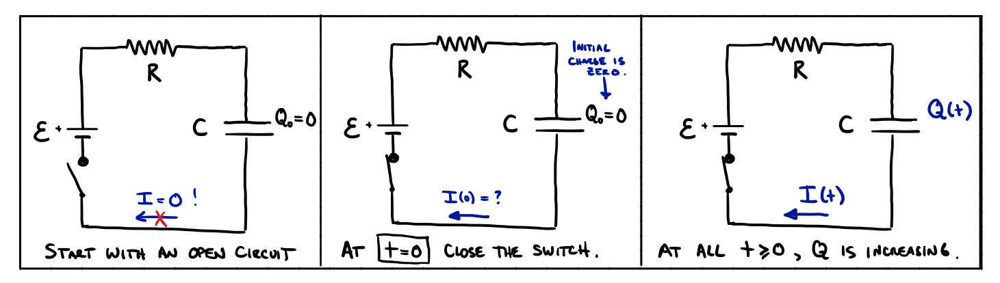

# RC Circuits

## Introduction and Overview

In the past few lectures we have studied circuits, in particular *circuits in equilibrium*. We looked at charged capacitors, which had been attached to an EMF (e.g., a battery) for a long time, leaving a charge $Q_\text{tot} = C \Delta V_C$.  We then looked at DC circuits with resistors, and we assumed that the currents in every wire was constant, unchanging in time.

Today we consider the first case of a circuit with *changing* current (we will see another example when we look at alternating current (AC) circuits, in which the power source is a sinusoidally oscillating EMF). Specifically, we will look at circuits with one capacitor and one resistor, and consider:

1. The discharge ($Q_\text{tot} \rightarrow 0$) of a charged capacitor, and
2. The charging of an unchanged capacitor ($0 \rightarrow Q_\text{tot}$) when connected to an EMF.

In each case, we will derive the time dependence of charge accumulation/loss, $Q(t)$, and thus also the dependence of $I(t)$ and $\Delta V_c(t)$.

To determine $Q(t)$ in each case above, we will write down a loop rule equation, $\sum \Delta V = 0$, show that it is actually a differential equation, and then solve the differential equation.

## Introduction to Differential Equations

### Overview

Given a quantity, $X$, that depends on time, a differential equation describes that time dependence through the derivatives of the quantity. For example:
```math
\frac{d^2X}{dt^2} + a \frac{dX}{dt} + b = 0 \quad \text{or} \quad \frac{dX}{dt} = aX^2
```
The first example is called a *linear* differential equation because each term contains, at most, one power of $X$; the right example is called a *nonlinear* differential equation because it contains an $X^2$ term. Generally, a linear equation can be solved, i.e., we can write down exactly how the quantity depends on time, $X(t) = f(t)$, where $f(t)$ is the *solution* and $X_0 = f(0)$ is an *initial condition*. A nonlinear differential equation generally needs to be solved "numerically", using a computer. The left example is called a *second-order differential equation* because it contains a second derivative. The right example is a *first-order diff. eqn*.

### Example: 2nd-order differential equation (SHO)

The solution to a first-order differential equation will have one unknown constant. The value of the constant must be set by your choice of the $X_0$ initial condition. A second-order diff. eqn solution contains two constants, set by $X_0$ and $\frac{dX}{dt}(t=0)$.


We encountered one example of a linear differential equation in PHY230, while studying oscillatory motion. Newton's second law applied to a mass on a spring was:

```math
\vec{F} = m\vec{a} \quad \Rightarrow \quad F_{\text{spring}} = -kx = m\frac{d^2x}{dt^2} \quad \Rightarrow \quad -kx = m\frac{d^2x}{dt^2}
```

We found that this second-order differential equation has the following solution:

```math
\frac{d^2x}{dt^2} = -kx \quad \Rightarrow \quad x(t) = A \cos(\omega t + \phi) \quad \text{with} \quad \omega^2 = \frac{k}{m}
```
Because if you take two derivatives of $x(t)$, you obtain $-\omega^2 x(t)$. The arbitrary constants in this solution, $A$ and $\phi$, were set by our choice of initial conditions, the initial position, $x(0)$, and velocity, $v(0)$.

To see this explicitly (using initial conditions to find $A$ and $\phi$), choose $\left[x_0 = 10 \text{ cm}, v_0 = 0 \right]$. Then:
```math
\begin{align}
10 \text{ cm} &= A \cos \left( \omega \cdot 0 + \phi \right) \quad \text{$x$ eqn}\\
0 &= - A \omega \sin \left( \omega \cdot 0 + \phi \right) \quad \text{$v_x$ eqn}
\end{align}
```
The second equation implies that $\sin\phi = 0$, which implies that $\phi = 0$ or $\phi = \pi$.  And the first equation gives us:
```math
A \cos \phi = 10 \text{ cm} \quad \rightarrow \quad \left[ A = 10 \text{ cm}, \phi =0\right]
```
So we have our final form of the position:
```math
x(t) = 10 \text{ cm} \cos \omega t
```
(see my PHY 230 notes for "Simple Harmonic Motion").

### Example: First-order linear differential equation

Today we will encounter a second linear differential equation. It is a first-order equation, and therefore has an even simpler solution (only one initial condition to deal with):
```math
\frac{dX}{dt} = aX
```
One way to solve this equation is to guess a solution (what function \( f(t) \) has a derivative that is itself times a constant?), but this equation can actually just be integrated:
```math
\begin{align}
\frac{dX}{dt} = aX \quad \Rightarrow \quad \frac{1}{X} \frac{dX}{dt} &= a \\
\int \left( \frac{1}{X} \frac{dX}{dt} \right) dt & = \int a \, dt \\
\int \frac{1}{X} \, dX & = at + C\\
\ln(X) & = at + C \\
X(t) & = e^{at + C'} \quad \Rightarrow \quad X(t) = A e^{at}
\end{align}
```
We can check that this is a solution:
```math
\frac{dX}{dt} = \frac{d}{dt} (A e^{at}) = A a e^{at} = a (A e^{at}) = a X(t) \quad \checkmark
```
The arbitrary constant \( A \), is determined by the chosen initial condition for \( X(t=0) = X_0 \):
```math
X_0 = X(0) = A e^{a \cdot 0} = A \cdot 1 \quad \Rightarrow \quad A = X_0
```

## Discharging a Capacitor

We start by considering the "filled" capacitor. We assume it has been charged by some EMF, $\mathcal{E}$, then was disconnected from the battery, and is now holding a charge on each plate of $Q_{\text{max}} = C  \mathcal{E}$. We connect it in series with a resistor, $R$, and then at $t=0$, close the loop by closing a switch. Current will flow from the positive plate, through the resistor, to the negative plate, until $Q=0$.


Considering the last box above, which corresponds to the dynamics of discharge for $t > 0$, we can write down Kirchhoff's loop rule:

```math
\begin{align}
\sum \Delta V_{\text{loop}} &= 0\\
-| \Delta V_R | + | \Delta V_C| &= 0 \quad \text{(Going CCW from top right)}\\
-I(t) R + \frac{Q(t)}{C} &= 0
\end{align}
```

We must be a little careful about the current variable, $I(t)$. Remember that we defined it to always be a positive number, with direction indicated by an arrow. Here, however, we would use $I(t)$ as the current on the top (positive) plate of the capacitor, $Q(t)$. The change in charge of the top plate, $Q(t)$, is decreasing over time. Therefore, we define:
```math
i(t) := \frac{dQ}{dt} = -I(t)
```
And our differential equation coming from Kirchhoff's loop rule becomes:
```math
\begin{align}
i(t)R + \frac{Q(t)}{C} &= 0\\
R\frac{dQ}{dt} + \frac{Q(t)}{C} &= 0 \Rightarrow \frac{dQ}{dt} = -\frac{1}{RC} Q
\end{align}
```

So, we have a linear, first-order differential equation for the charge on the (positive) plate of the capacitor. Luckily, this is exactly the equation we already solved in the section on diff eq's. Here, the constant is $a = -\frac{1}{RC}$, so we can just write down the solution:
```math
Q(t) = A e^{-\frac{t}{RC}}
```
Now we must deal with the unknown integration constant, $A$. Remember, its value is set by our statement about the initial condition, $Q_0 = Q(t=0)$. From our setup we know that $Q_0 = Q_{\text{max}} = C \mathcal{E}$, so:
```math
Q_0 = Q(0) = A e^{-\frac{0}{RC}} = A \Rightarrow A = Q_0 = C \mathcal{E}
```
And therefore our final solution is:
```math
Q(t) = Q_{\text{max}} e^{-\frac{t}{RC}} = C \mathcal{E} e^{-\frac{t}{RC}} \quad \text{Discharging a Capacitor}
```

Using the expression for $Q(t)$, we can also now find the current, $I = -\frac{dQ}{dt}$, and the potential difference across the capacitor, $\Delta V = \frac{Q(t)}{C}$, at all times:
```math
I(t) = -\frac{dQ}{dt} = -\frac{d}{dt} (C \mathcal{E} e^{-\frac{t}{RC}}) = -\left( -\frac{1}{RC} \right) C\mathcal{E} e^{-\frac{t}{RC}}
```
yielding:
```math
I(t) = \frac{\mathcal{E}}{R} e^{-\frac{t}{RC}}
```
and 
```math
\Delta V(t) = \frac{Q(t)}{C} = \frac{1}{C} \cdot C \mathcal{E} e^{-\frac{t}{RC}}
```
gives
```math
\Delta V =\mathcal{E} e^{-\frac{t}{RC}}
```

Notice that you can read off from the above expressions the initial ($t=0$) values of $I$ and $\Delta V_C$: $\mathcal{E}/R$ and $\mathcal{E}$, respectively. At $t=0$, current flows as if the capacitor is a battery with EMF $\mathcal{E}. [Our book muddles this point, claiming that you should know $I(t=0)$ before you find $Q(t)$.]

So what do these functions look like?  They are each exponentials, with *time constant* $\tau = RC$:


What we mean by the "time constant", $\tau$, is that the function $f(t) = A \exp[-t/\tau]$ drops off to $1/e \approx 1/3$ of its $t=0$ value (i.e., $A \rightarrow 1/e A$) in the time $\tau$.

## Charging a Capacitor

We starting our discussion of capacitors a few lectures ago by assuming they were fully charged; after connecting a battery to the capacitor for a long time, it acquires a charge $Q_{max} = C \mathcal{E}$. Now we will try to understand how that charging process occurs. We will assume there is a resistor $R$, in the circuit, and the battery is an ideal EMF, $\mathcal{E}$.



Using the case on the right (capacitor charging at $t > 0$) we can write a Kirchhoff loop rule equation:

```math
\begin{align}
\sum \Delta V &= 0 \\
+|\Delta V_{R}| - |\Delta V_{batt}| + |\Delta V_{C}| &= 0\\
+I(t)R - \mathcal{E} + \frac{Q(t)}{C} &= 0 
\end{align}
```
Again, we must be careful to correctly relate the current, $I(t)$, to the change in the charge on the capacitor $i(t)$: $\frac{dQ}{dt}$. In this case $Q$ is increasing, so
```math
i(t) = +\frac{dQ}{dt}
```
And we can write:
```math
\frac{dQ}{dt} \cdot R - \mathcal{E} + \frac{Q(t)}{C} = 0 \quad \rightarrow \quad \frac{dQ}{dt} = \frac{\mathcal{E}}{R} - \frac{Q}{RC}
```

This is again a linear, first-order differential equation, but the presence of the constant term, $\mathcal{E}/R$, complicates things slightly. The easiest way to deal with this is to make a substitution (a change of variables). Let's write:
```math
\frac{dQ}{dt} = -\frac{1}{RC} ( Q - C \mathcal{E} )
```
And define a new variable, $u := Q - C \mathcal{E}$. The derivative of this variable is:
```math
\frac{du}{dt} = \frac{d}{dt} \left( Q(t) - C \mathcal{E} \right) = \frac{dQ}{dt}
```
So we can rewrite our differential equation as:
```math
\frac{du}{dt} = -\frac{1}{RC} u \quad \quad \text{(ah... that's better!)}
```
Which we know has solution:
```math
u(t) = A e^{-t/RC}
```

