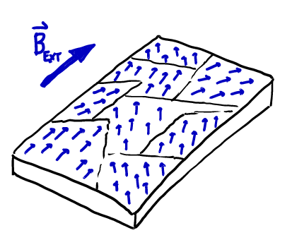

# Magnets, Magnetic Fields, and Magnetic Forces

## Magnets and Magnetism

### Basic Properties of Magnets


* Magnets are intrinsically **dipolar**, having a "North" and a "South" **pole**.
* Magnetic dipoles cannot be divided into N/S monopoles, cutting a magnet in two creates two magnets:


* There are **attractive/repulsive forces** between opposite/same poles:


* A magnet has a surrounding magnetic field (more later).


* A magnet (e.g., a compass needle) will *align* in the magnetic field of another magnet (e.g., the Earth). (There is a torque on a magnetic dipole causing this alignment, we will not explore this further).


### Magnetic Materials


We will see in the next lecture that moving charge (or current) creates a magnetic field. Magnetic materials (magnets) have a magnetic field because of moving charge on the atomic level.


There are two types of atomic-scale magnetic dipoles, due to:
1. "Orbital motion" of the electron about the nucleus,
2. "Spin" — an intrinsic magnetic dipole characteristic of electrons.

Note: At this small scale, these effects are necessarily quantum. Moving/spinning charge is a convenient metaphor, but an inaccurate description.


A material is said to be **magnetic** if it has a net atomic dipole (due to, e.g., unpaired valence electrons) that can align with an external magnetic field.



So-called "Permanent Magnets" are made from **ferromagnetic8* materials. These have large atomic dipoles and the ability to form large domains of aligned dipoles in the presence of an external magnetic field. These domains remain when the external field is removed.


If a ferromagnetic material is heated above a critical temperature (the **Curie temperature**) it loses the ability to form domains (and thus lasting magnetism). These materials are called **paramagnetic**.


## Magnetic Field

Just as we defined the electric field through the force on a test charge, we will define magnetic field direction by the alignment of magnets within it.


The **magnetic field at a point in space** points in the direction of a magnet's alignment (e.g., a compass needle).

**Magnetic field lines** are continuous lines which are everywhere parallel to the magnetic field.

We can probe the space around a magnet with a compass to determine the magnetic field at each point in space (see below)

### Magnetic field lines of a bar magnet


### Magnetic field of the Earth

Compasses can also be used to probe the **magnetic field of the Earth**. In our classroom in Allendale, MI, compasses restricted to the horizontal and vertical planes shown:


These probes indicate that the magnetic field points down into the Earth, with a component pointing toward our geographic North Pole.

If we put this on a globe and assume some symmetry...


Based on the field lines drawn, you can sketch the "bar magnet that sits inside the Earth" to create this field (do it!). The field actually flips its polarity every 100,000 years or so, and we don’t actually know exactly what creates the field or its dynamics.

## Magnetic Force on a Moving Charge or Current

A current-carrying wire in a magnetic field will experience a force in a direction perpendicular to both the wire and the field lines, a charged particle moving in a magnetic field will experience a force perpendicular to its velocity and the field.

### Force on a moving charge

The **force on a moving charge** is proportional to the charge, the field strength and the particle speed. Therefore:
```math
\vec{F}_B = q\vec{v} \times \vec{B}
```
where this **cross product** of vectors means that the magnitude is:
```math
|\vec{F}_B| = |q||\vec{v}||\vec{B}|\sin\theta_{vB}
```
and the direction of the force is given by the **right hand rule**:

1. Point the fingers of your right hand along the first vector $\vec{v}$.
2. Close your fingers in the direction of the second vector $\vec{B}$.
3. The resulting vector $\vec{F}_B$ points in the direction of your thumb.


Note from the basic equation for $\vec{F}_B$, however, that a negative charge, $q<0$, will experience a force in the opposite direction to what is found in the picture.

### The Force on a Straight Segment of Current-Carrying Wire

The ***force on a straight segment of current-carrying wire*** is:
```math
\vec{F}_B = I \vec{l} \times \vec{B}
```
where $I > 0$ is the current and $\vec{\ell}$ is a vector pointing in the direction of the current, with magnitude equal to the length of the wire. Using the rules for the cross product, this means
```math
|\vec{F}_B| = I \ell B \sin\theta_{\ell B}
```
and the direction is found by the right-hand rule:


### Drawing vectors in a third direction

Because we now have vectors in 3 directions, we will need a way to represent fields pointing into and out of the page. (Imagine an arrow (of a bow and arrow) coming toward you, or away from you)


## Example: The "velocity selector"

### Question: Parallel plates are connected to a battery creating a uniform $\vec{E}$ field of magnitude $E$. What is the direction and magnitude of the magnetic field which would allow an electron to pass through the plates (undeflected) with speed $v$?

### Solution


The electric field will cause a force on the electron
```math
\vec{F}_e = q\vec{E} = -e\vec{E}
```
pointing opposite to the field.


To balance $\vec{F}_E$ there must be a downward-pointing force, $\vec{F}_B$, of equal magnitude.

Using the right-hand rule (and remembering that $q < 0$) we see that $\vec{B}$ must point out of the page.


To find the magnitude, we apply Newton's second law:
```math
\begin{align}
\vec{F}_E + \vec{F}_B &= m\vec{a}\\
\vec{F}_E + \vec{F}_B &= 0 \quad (\text{equilibrium})\\
\text{$y$:  } F_{Ey} + F_{By} &= 0 \\
+F_E - F_B = 0 
& \rightarrow F_E = F_B
\end{align}
```
And since $\vec{v}$ is perpendicular to $\vec{B}$ $\left(\theta_{vB}=90^\circ \right)$:
```math
|q| E = |q| v B \sin{90^\circ} \quad \rightarrow \quad B = \frac{E}{v}
```


