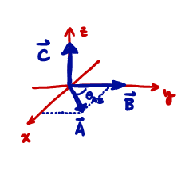
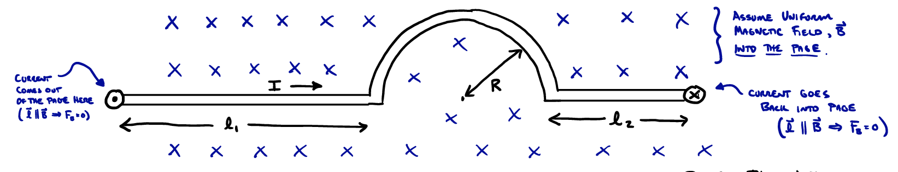

# Magnetic Force on Current-Carrying Wires and Torque on Loops of Current

## Review of Magnetic Force on Charged Particles and Straight Current-Carrying Wires


Last time we saw that a charged particle, $q$, moving at velocity $\vec{v}$ within a magnetic field $\vec{B}(\vec{r})$, experiences a force:
```math
\vec{F}_B = q\vec{v} \times \vec{B}
```
where, recall, the vector product of two vectors $\vec{A}$ and $\vec{B}$ produces another vector $\vec{C} = \vec{A} \times \vec{B}$ which is perpendicular to both $\vec{A}$ & $\vec{B}$ (so, perpendicular to the plane formed by $\vec{A}$ & $\vec{B}$) and has magnitude $A B \sin \theta$



So we can say:
```math
\vec{F}_B = \left\{ |\vec{F}_B| = |q||\vec{v}| B \sin \theta, \quad \text{Direction given by Right-Hand Rule}\right\}
```

We also saw last time that the force on a straight current-carrying wire of length $l$, carrying current $I$, within a uniform magnetic field $\vec{B}$, will experience a net magnetic force:
```math
\vec{F}_{net} = I \vec{l} \times \vec{B}
```
where $\vec{l}$ points in the direction of current flow, and $|\vec{l}| = l$.

Today, we will consider the net force on a non-straight wire, by using the formula above for only a small segment $\Delta \vec{r}$, which can be assumed approximately straight, and then summing (i.e., constructing an integral) to find the net force. We'll also consider the torque on a loop of current-carrying wire.

## Force on a Curved Current-Carrying Wire (An Example):

We wish to determine the net force on a wire with a semi-circular loop:



We can see that the net force on the wire will be the sum of three parts, that on the left straight wire (length $l_1$), the right (length $l_2$), and on the semicircular part:
```math
\vec{F}_{net} = \vec{F}_{left} + \vec{F}_{circ} + \vec{F}_{right} = I \vec{l}_1 \times \vec{B} + [???] + I \vec{l}_2 \times \vec{B}
```

We are interested in calculating the force on the semi-circle, $\vec{F}_{circ}$, and we will do so by assuming the following for a straight wire plus a small segment $\Delta \vec{r}$, of the whole curved part:
```math
\vec{F}_{circ} \approx \sum \Delta \vec{F}_i = \sum I \Delta \vec{r}_i \times \vec{B}
```
where $\Delta \vec{r}_i$ is the vector length of the $i^{th}$ chunk of wire, in the magnetic field at $\vec{r}_i$ with chunk.


