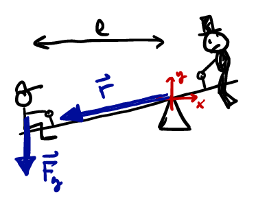

# Magnetic Force on Current-Carrying Wires and Torque on Loops of Current

## Review of Magnetic Force on Charged Particles and Straight Current-Carrying Wires


Last time we saw that a charged particle, $q$, moving at velocity $\vec{v}$ within a magnetic field $\vec{B}(\vec{r})$, experiences a force:
```math
\vec{F}_B = q\vec{v} \times \vec{B}
```
where, recall, the vector product of two vectors $\vec{A}$ and $\vec{B}$ produces another vector $\vec{C} = \vec{A} \times \vec{B}$ which is perpendicular to both $\vec{A}$ & $\vec{B}$ (so, perpendicular to the plane formed by $\vec{A}$ & $\vec{B}$) and has magnitude $A B \sin \theta$


So we can say:
```math
\vec{F}_B = \left\{ |\vec{F}_B| = |q||\vec{v}| |\vec{B}| \sin \theta, \quad \text{Direction given by Right-Hand Rule}\right\}
```

We also saw last time that the force on a straight current-carrying wire of length $l$, carrying current $I$, within a uniform magnetic field $\vec{B}$, will experience a net magnetic force:
```math
\vec{F}_{net} = I \vec{\ell} \times \vec{B}
```
where $\vec{\ell}$ points in the direction of current flow, and $|\vec{\ell}| = l$.

Today, we will consider the net force on a non-straight wire, by using the formula above for only a small segment $\Delta \vec{r}$, which can be assumed approximately straight, and then summing (i.e., constructing an integral) to find the net force. We'll also consider the torque on a loop of current-carrying wire.

## Force on a Curved Current-Carrying Wire (An Example):

We wish to determine the net force on a wire with a semi-circular loop:


We can see that the net force on the wire will be the sum of three parts, that on the left straight wire (length $l_1$), the right (length $l_2$), and on the semicircular part:
```math
\vec{F}_{net} = \vec{F}_{left} + \vec{F}_{circ} + \vec{F}_{right} = I \vec{l}_1 \times \vec{B} + [???] + I \vec{l}_2 \times \vec{B}
```

We are interested in calculating the force on the semi-circle, $\vec{F}_{circ}$, and we will do so by assuming the following for a straight wire plus a small segment $\Delta \vec{r}$, of the whole curved part:
```math
\vec{F}_{circ} \approx \sum \Delta \vec{F}_i = \sum I \Delta \vec{r}_i \times \vec{B}
```
where $\Delta \vec{r}_i$ is the vector length of the $i^{th}$ chunk of wire, in the magnetic field at $\vec{r}_i$ with chunk.

It is useful to look at the situation quantitatively first (as we did for electric fields due to continuous distributions of charge), looking at the forces on individual chunks:


1. We see that $\Delta \vec{r} \perp \vec{B}$, and the R.H.R. shows that $\vec{F}$ on any chunk is radially directed,
2. Therefore the $x$-components of the forces will cancel and we need only calculate $F_y$.


So, we write down our sum using the $n^{th}$ chunk:
```math
\begin{align}
F_{circ,y} &= \lim_{N \to \infty} \sum_{n=1}^{N} \left[ |\vec{F}_n| \sin \theta_n \right]\\
&= \lim_{N \to \infty} \sum_{n=1}^{N} \left[ |I \Delta \vec{r}_n \times \vec{B}| \sin \theta_n \right]\\
&= \lim_{N \to \infty} \sum_{n=1}^{N} \left[ I |\Delta \vec{r}_n| B \sin(\pi/2) \sin \theta_n \right] \\
& = \lim_{N \to \infty} \sum_{n=1}^{N} I R B \sin \theta_n \Delta \theta \\
& = I R B \lim_{N \to \infty} \sum_{n=1}^{N} \sin \theta_n \Delta \theta \\
& = I R B \int_{0}^{\pi} \sin \theta d\theta \\
F_{circ,y} & = I R B \left[ -\cos \theta \right]_0^{\pi} = 2 I R B
\end{align}
```
So, the net force on the whole system of three wire segments is:
```math
\vec{F}_B = \left[ \vec{I} dl + 2I R B + I \vec{l}) \vec{B} \right] \, \hat{j}
```

## Forces and Torques on Current-Carrying Loops

We will consider magnetic forces on rectangular loops of current, because they are easy, but much the same would be true for circles (continuing as we did above). We can easily see that the force on a rectangular loop of current in a uniform magnetic field is zero:


(Use the RHR to find the force vector on each side, and then graphically sum the vectors.)

### Review of Torque

Recall the definition of torque on an object rotating about an axis (consider $z$ the axis of rotation, and $x$-$y$ the plane of rotation):



```math
\begin{align}
\vec{\tau} & = \vec{r} \times \vec{F} \\
\rightarrow \quad |\vec{\tau}| & = |\vec{r}||\vec{F}|\sin \theta_{rF} \\
& = F r_{\perp} \\
& = F r \sin \theta
\end{align}
```

Note that in the figure above, the magnitude of the torque of the child's weight is  $\tau = \ell m g$, where we have used the second expression for $|\vec{\tau}|$, where $\ell = r_\text{perp to F}$.

### Torque on current loop

So, we could find the torque on a current loop:


```math
\begin{align}
\vec{\tau}_{net} &= \vec{\tau}_{F1} + \vec{\tau}_{F2} + \vec{\tau}_{F3} + \vec{\tau}_{F4}\\
& = 0 + 0 + 0 + 0
\end{align}
```
because we can see in the figure that $\vec{r}_1$ and $\vec{r}_3$ have $|\vec{r}| = 0$, and both $\vec{r}_2$ and $\vec{r}_4$ are parallel to their respective forces.

However, if we place the loop at an angle with respect to the magnetic field (in the above figure, the normal vector to the loop area was in the same direction of $\vec{B}$):


we obtain a different result:
```math
\begin{align}
\vec{\tau}_{net} &= \vec{\tau}_{F1} + \vec{\tau}_{F2} + \vec{\tau}_{F3} + \vec{\tau}_{F4}\\
& = 0 + |\vec{\tau}_{F_2}| + 0  + | \vec{\tau}_{F_4}| \quad \quad  \text{(zeros because $|\vec{r}| = 0$)}\\
&= I w B \ell \sin \theta + I w B \ell \sin \theta \\
& = 2 I w B \ell \sin \theta \\
& = I \times 2 w \ell B \sin \theta\\
& = I \times A B \sin \theta \\
& = I A B \sin \theta
\end{align}
```

### Magnetic dipole moment

Writing that final expression in terms of the area of the loop allows us to define the **magnetic dipole moment** of the current loop:
```math
\vec{\mu} = I A
```


Or, defining the dipole moment to be a *vector* pointing normal to the loop face, we have:
```math
\vec{\tau} = \vec{\mu} \times \vec{B}
```


