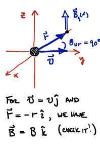

# Magnetic field of a moving charge: The Biot-Savart Law

## Introduction

We have talked about forces of magnetic fields on moving charges, but haven't said much about where the magnetic fields come from. Within our axioms of electromagnetism (Maxwell's equations: see the first lecture notes, "Math Mechanics Review", and the lecture notes on Gauss's Law), the generation of magnetic fields is taken care of by this equation:
```math
\nabla \times \vec{B} = \mu_0 \left( \frac{\partial \vec{E}}{\partial t} + \vec{J} \right)
```
where
```math
\vec{\nabla} \times \vec{B} = \mu_0 \vec{J}
```
is one form of *Ampere's Law* (which we will cover in the next lecture), and where 
```math
\varepsilon_0 \frac{\partial \vec{E}}{\partial t} = \vec{J}_D
```
is called the *Displacement Current* (which we will see in a few more lectures. Therefore, in a very rough sense, that says that magnetic field is caused by two sources: a changing electric field $\left( \frac{\partial \vec{E}}{\partial t} \right)$ and a current $(\vec{J}$ is the current density). We will consider the latter of those two cases next time when we write down Ampere's Law.


But just like Gauss's Law (the fundamental equation regarding the generation of an electric field) implied an expression that was sometimes easier to use — the electric field of a point charge, $E = \frac{kQ}{r^2}$ — there is an analogous equation for the **magnetic field of a moving point charge**:
```math
\vec{B}(\vec{r}) = \frac{\mu_0}{4\pi} \frac{q \vec{v} \times \vec{r}}{{r}^3}= \frac{\mu_0}{4\pi} \frac{q \vec{v} \times \hat{r}}{{r}^2}
```
where the $\vec{r}$ vector points from the charge to the point in space where you want to find the field $\vec{B}$ (see figure above). This equation contains all of the information in Ampere's Law, but is formulated in a mathematical language that is easier to understand.

The Biot-Savart Law is simply the above equation written in terms of current. We will use it to "integrate up" the current contributions of a single point in space, due to a long current-carrying wire (just like we did to find the electric field and electric potential of a continuous distribution of charges).

It turns out there is a third thing that generates magnetic field (aside from the current of Ampere's/Biot-Savart Law, and the changing $E$ of the "Displacement Current", the reason that it does not appear in our axioms of electromagnetism is that it is a purely quantum effect, and thus not part of classical E-M. This is the intrinsic spin of elementary particles. Spin is a property of an elementary particle just like charge/mass. The spin can be associated to a magnetic moment, $\mu$ (see last lecture). One important achievement of Feynman's Quantum Electrodynamics was predicting $\mu_A$.  Watch [Richard Feynman's public lectures on "QED"](http://www.vega.org.uk/video/subseries/8) if you are interested in this.


## Magnetic Field Produced by a Single Moving Charge



The magnetic field at $\vec{r}$ with respect to a moving charge $q$ is:
```math
\vec{B}_q(\vec{r}) = \frac{\mu_0}{4\pi} \frac{q\vec{v} \times \vec{r}}{r^3}
```
From what we know about the vector product, $|\vec{A} \times \vec{B}| = AB \sin(\theta)$, we can immediately write down the *magnitude* of the field produced:
```math
|\vec{B}_q(\vec{r})| = \frac{\mu_0}{4\pi} \frac{|q||\vec{v} \times \vec{r}|}{r^3} = \frac{\mu_0}{4\pi} \frac{|q|v}{r^2} \sin\theta_{rv}
```
where $\theta_{rv}$ is the angle between $\vec{r}$ and $\vec{v}$. The *direction* of $\vec{B}$ is found using the right-hand rule (fingers along $\vec{v}$, close them toward $\vec{r}$, thumb points along $\vec{B}$). Or, given the components of each vector, you can use:
```math
\vec{u} \times \vec{v} = \begin{vmatrix} \hat{i} & \hat{j} & \hat{k} \\ u_x & u_y & u_z \\ v_x & v_y & v_z \end{vmatrix} = \hat{i}(u_yv_z-u_zv_y) - \hat{j}(u_xv_z-u_zv_x) + \hat{k}(u_xv_y-u_yv_x)
```


This image from the book nicely shows that the magnetic field vectors are tangent to *circles* enclosing the straight path of a particle, with largest magnitude around the particle itself and decreasing magnitude ahead and behind it.

Consider each point and convince yourself using the black $\vec{r}$ vectors, and $\vec{v}$, that $\vec{B}$ indeed points that way. (Notice that $\vec{v}$ and $\vec{r}$ form a plane in either the gray or gold surfaces, and that $\vec{B}$ is perpendicular to that plane.)


**Question:** If two protons are, at some moment, moving parallel to one another, is it possible for them to continue in this way, given that each experiences electric and magnetic forces? [Submit an answer on the response questions]
