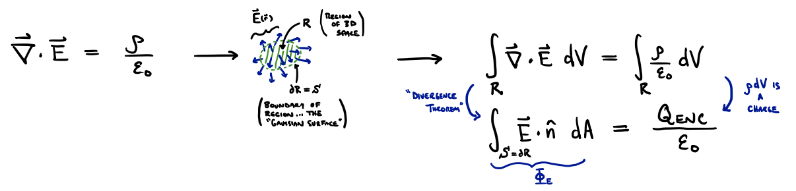
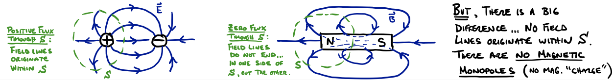

# Ampere's Law

## Introduction

As mentioned last lecture, we return to Maxwell's Equations to find a piece that describes the magnetic field created by currents. The full equation, and the piece we consider today is:
```math
\nabla \times \vec{B} = \mu_0 \frac{\partial \vec{E}}{\partial t} + \mu_0 \vec{J}
```
So, we are ignoring changing electric fields for the moment and considering only how magnetic fields relate to current density, $\vec{J}$.

We will now convert this equation from the entirely foreign mathematical language of partial derivative operators ($\nabla \times \vec{B}$ is called the "curl" of the vector field $\vec{B}$), into the slightly more familiar language of line integrals. We do this in almost the same way we dealt with Gauss's Law in the third lecture, i.e., by thinking an integral. Recall that we did this:



```math
\nabla \cdot \vec{E} = \frac{\rho}{\varepsilon_0} \quad \rightarrow \quad
\oint \vec{E} \cdot d\vec{A} = \frac{Q_{\text{enc}}}{\varepsilon_0}
```
In words: we took a volume integral of both sides over some region of space $R$, on the right-hand side that gave us the sum of all charge in the region (or the "charge enclosed" by the boundary surface $S = \partial R$), and on the left-hand side we used a theorem to write the volume integral of the divergence as the flux of the electric field through the bounding surface $S$ (the so-called "Gaussian surface"). Before making a similar transformation of Ampere's Law, let's do exactly the same transformation of another one of Maxwell's Equations:
```math
\nabla \cdot \vec{B} = 0 \quad \rightarrow \quad \oint \nabla \cdot \vec{B} dV = \oint 0 dV \implies \oint \vec{B} \cdot d\vec{A} = 0
```

This law, "Gauss's Law for Magnetic Fields," tells us that the flux of the magnetic field through any closed surface is zero. We have seen this in all of our pictures of magnetic fields ... all field lines "close," similarly to the electric field lines of an electric dipole.



