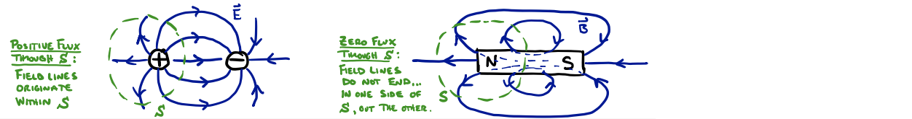
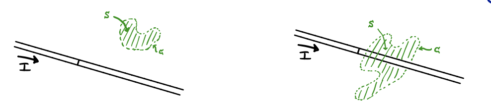
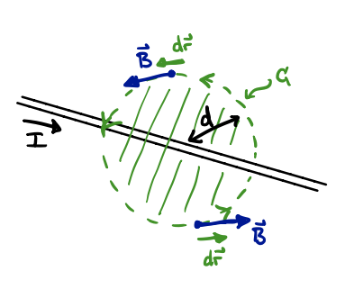

# Ampere's Law

## Introduction

As mentioned last lecture, we return to Maxwell's Equations to find a piece that describes the magnetic field created by currents. The full equation, and the piece we consider today is:
```math
\nabla \times \vec{B} = \mu_0 \frac{\partial \vec{E}}{\partial t} + \mu_0 \vec{J} \quad \rightarrow \quad \nabla \times \vec{B} = \mu_0 \vec{J} 
```
So, we are ignoring changing electric fields ($\partial \vec{E} / \partial t = 0$) for the moment and considering only how magnetic fields relate to current density, $\vec{J}$.

We will now convert this equation from the entirely foreign mathematical language of partial derivative operators ($\nabla \times \vec{B}$ is called the "curl" of the vector field $\vec{B}$), into the slightly more familiar language of line integrals. We do this in almost the same way we dealt with Gauss's Law in the third lecture, i.e., by taking an integral. Recall that we did this:


```math
\nabla \cdot \vec{E} = \frac{\rho}{\varepsilon_0} \quad \rightarrow \quad
\oint_{S = \partial R} \vec{E} \cdot \hat{n} \,dA = \frac{Q_{\text{enc}}}{\varepsilon_0} 
```
In words: we took a volume integral of both sides over some region of space $R$, on the right-hand side that gave us the sum of all charge in the region (or the "charge enclosed" by the boundary surface $S = \partial R$), and on the left-hand side we used a theorem to write the volume integral of the divergence as the flux of the electric field through the bounding surface $S$ (the so-called "Gaussian surface"). 

Before making a similar transformation of Ampere's Law, let's do exactly the same transformation of another one of Maxwell's Equations:
```math
\nabla \cdot \vec{B} = 0 \quad \rightarrow \quad \oint_R \nabla \cdot \vec{B} \, dV = \oint_R 0 \, dV \quad \rightarrow \quad \oint_{S = \partial R} \vec{B} \cdot \hat{n} \, dA = 0
```

This law, "Gauss's Law for Magnetic Fields," tells us that the flux of the magnetic field through any closed surface is zero. We have seen this in all of our pictures of magnetic fields ... all field lines "close," similarly to the electric field lines of an electric dipole.



But, there is a big difference... For the magnetic field, no field lines *originate* within the "gaussian surface" $S$.  **There are no magnetic monopoles** (no "magnetic charge").

So, let us now convert Ampere's law. This time we will make use of a different theorem, called Stoke's theorem, which says that the flux of the curl of a vector field, $\vec{F}(t)$, through some 2D surface, $S$, is equal to the line integral around the closed loop of its boundary, i.e., $\partial S = \delta S$. In equations:
```math
\Phi_{\vec{\nabla} \times \vec{F}} = \int_{S} (\nabla \times \vec{F}) \cdot \hat{n} \, dA = \oint_{C=\partial S} \vec{F} \cdot d\vec{r} = \oint_{C} \vec{F} \cdot \vec{v} \, dt \quad \quad \text{Stoke's Theorem}
```
where, recall that the "velocity" in the line integral is the time derivative of the position specifying the parameterized path, $\vec{r}(t)$, i.e., $\vec{v} = \frac{\mathrm{d}\vec{r}}{\mathrm{d}t}$.

So, we rewrite the differential form of Ampere's Law:
```math
\begin{align}
\nabla \times \vec{B} &= \mu_0 \vec{J}\\
\int_{S} (\nabla \times \vec{B}) \cdot \hat{n} \, dA & = \int_{S} \left(\mu_0 \vec{J}\right) \cdot \hat{n} \, dA \\
\oint_{C=\partial S} \vec{B} \cdot \mathrm{d}\vec{r} & = \mu_0 \int_{S} \vec{J} \cdot \hat{n} \, dA\\
\oint_{C=\partial S} \vec{B} \cdot \mathrm{d}\vec{r} & = \mu_0 \, I_\text{through $S$}
\end{align}
```
where we've used Stoke's Theorem in going from line two to line three, and we've used the definition of the current (in terms of the current density) in obtaining the last line.

This equation will play the role that Gauss's Law did for electric fields: it will connect the magnetic field in space to its source, current flow. Similar to Gauss's Law, the equation is always true, but only yields a useful and easy calculation for systems with a lot of symmetry.

### Example: Long, straight, current-carrying wire.

Just as we did for Gauss's Law, we will need to apply symmetry arguments to understand the basic picture of the magnetic field $\vec{B}$ and to construct easily calculable problems with Ampere's Law. 

For a long, straight, current-carrying wire, we know that the rotational symmetry of the wire about an axis along it means that $\vec{B}$ has the same magnitude at all points on an enclosing circle.


*Symmetry argument*: Because the wire and its current are unchanged under rotation, and because the magnetic field they produce must have the same symmetry, it must be true that:
```math
| \vec{B} \left(\vec{r}_1\right)| = | \vec{B} \left(\vec{r}_2\right)| = | \vec{B} \left(r \right)|
```
for any two points with $|\vec{r}_1| = | \vec{r}_2 | = r$, i.e., any two points on that circle.

It turns out that arguing for the *direction* of $\vec{B}$ on that circle is harder than it was for $\vec{E}$, so we will simply accept our prior knowledge from the right-hand rule applied to Biot-Savart ( $\vec{B}$ points tangent to the circle).

(Note: Some details about it being "harder". It is related to $\vec{B}$ being a so-called "pseudovector", which acquires a minus sign (a flip into the opposite direction) for any reflectional transformation.)

Now that we know the basic features of $\vec{B}(\vec{r})$ (direction and symmetry of magnitude), we can use Ampere's Law to determine its magnitude at any point in space. Just as Gauss's Law required us to choose a closed "Gaussian Surface", $S$, Ampere's Law requires us to choose a closed curve, $C$ (called an "Amperian loop"), and its spanning surface $S$. Any choice is allowed:



But, just as with Gauss's Law, only some choices will be useful. The choice at left has no "current through $S$", so the line integral of $\vec{B}$ along $C$ will give us zero (like a Gaussian surface enclosing no charge gives us zero flux). The choice at right does have current passing through $S$, but we know (from our symmetry discussion above) that $\vec{B}$ is different at every point along $C$. So it will make the line integral difficult to calculate (though not impossible... see Figure 28.17a in Y&F).



We choose, then, an "Amperian Loop" that takes advantage of the symmetry, i.e., an enclosing circle. We choose the direction of integration around $C$ to be  given by the right-hand rule with respect to the current (pointing thumb along $I$, $C$ curls with fingers). And thus we see that the $d\vec{r}$ vectors point with the $\vec{B}$ vectors at each point on the loop. The line integral becomes very simple then...
```math
\begin{align}
\oint_{C = \partial S} \vec{B} \cdot d\vec{r} &= \mu_0 \, I_{through \; S}\\
\oint_C B dr &= \mu_0 \, I \\
B \oint_C dr &= \mu_0 \, I \\
B (2 \pi d) &= \mu_0 \, I \\
& \quad \rightarrow \quad B(d) = \frac{\mu_0 \, I}{2 \pi d}
\end{align}
```
The "choice of direction of integration" is arbitrary, actually, because it is paired with the direction of the normal vector to the surface.  The "current through $S$" was positive for our choice because the normal vector for that counter-clockwise direction of integration is *out of the page*... it points in the same direction as the current, so we had a positive "current through $S$" on the right-hand side. If we had chosen, in the figure above, a clockwise integration direction for $C$, then the normal vector to $S$ would point *into the page* (to the left along the wire), and therefore the current going the opposite direction through the surface would have yielded $-I$, cancelling out the negative sign arising because $d\vec{r}$ would be antiparallel to $\vec{B}$.
