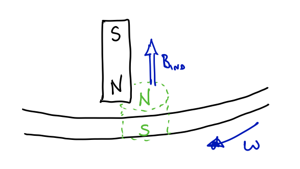

# Magnetic Induction

## Observations of Induction

Last time we saw that moving charge or current creates a magnetic field. Today we will see, amazingly, the opposite effect: a changing magnetic field induces an electric field (or EMF) which can drive a current in a wire or other conductor.

A simple experiment demonstrates this magnetic induction of current. Consider the circuit below without a battery. When a magnet is moved into or out of the large wire loop, a current goes through the circuit and is detected by the ammeter.


Today will develop the theory which explains these experiments: Faraday's Law of Induction & Lenz's Law.

## Magnetic Flux

To describe induction correctly we need a way of specifying how much magnetic field is passing through the wire loop. This is called the flux of magnetic field through the loop's area.

The magnetic flux, $\Phi_B$, of a uniform magnetic field, $\vec{B}$, passing through a flat surface with area $A$ is given by:
```math
\Phi_B = \vec{B} \cdot \vec{A} = BA \cos \theta_{BA}
```
where the area vector, $\vec{A}$, has a magnitude equal to the surface's area and a direction *perpendicular to the surface*.


The flux can be thought of as proportional to the number of B-field lines that pierce the surface.  Note how the value of flux changes as the orientation of the surface changes.


For a surface that is not flat, of a field that is not uniform, the flux is calculated over small area segments of the surface (which are approximately flat and have approximately uniform field passing through).


The total flux through the surface is found by adding up (using calculus) the flux through each little piece, $dA$.

## Faraday's Law of Induction (Magnitude of induced EMF)

The induced current flow we saw in the introductory experiments comes from an induced EMF (voltage) in the wire loop : $I_{\text{ind}} = \frac{\mathcal{E}_{\text{ind}}}{R_{\text{loop}}}$. Careful experiments by Michael Faraday (English, c1830) showed that this EMF is caused by changing magnetic flux.

The *average induced EMF*, $\mathcal{E}_{\text{ind}}$, in a loop of wire over a time interval $\Delta t$ is:
```math
\mathcal{E}_{\text{ind}} = \frac{\Delta \Phi_{B}}{\Delta t} \quad \text{(Faraday's Law)}
```
If multiple loops of wire are used (e.g., a solenoid coil) then the induced EMF increases proportionally:
```math
\mathcal{E}_{\text{ind}} = N_{\text{loops}} \frac{\Delta \Phi_{B}}{\Delta t}
```

## Lenz's Law (Direction of Induced Current)

While Faraday's Law gave us the magnitude of the induced EMF due to a changing magnetic field, Lenz's Law tells us the direction of the induced current flow. Importantly, this induced current, in turn, produces an induced magnetic field $\vec{B}_{\text{ind}}$ (by Biot-Savart).

**Lenz's Law**: The current induced in a loop of wire (due to $\mathcal{E}_{\text{ind}}$, due to $\Delta \vec{B}/\Delta t$) will have a direction such that the magnetic field it produces, $\vec{B}_{\text{ind}}$, *opposes the **change** in flux* of the original magnetic field through the loop.

For example, consider a bar magnet being pushed into (or pulled out of) a loop of wire.


## Eddy Currents

Although we have only talked about induced currents in loops of wire, the phenomenon can occur when magnetic flux changes in any conductor.

Magnetic Braking: Holding a magnet near a moving (non-magnetic) conductor causes it to slow!


So, effectively, a bar magnet is induced in the turntable: North pole on North pole causes repulsion.



But actually a second effect also happens:


As the green loop leaves the magnet (downward flux from magnet is decreasing) a downward induced field is created... The south pole of the "induced magnet" is attracted to the north pole of the bar magnet.

Each of these effects cause the turntable to slow down.

