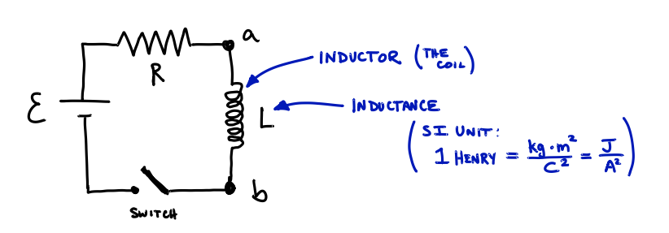
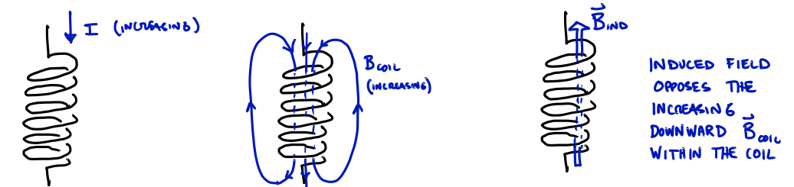
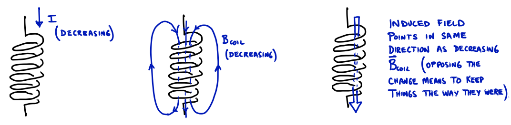
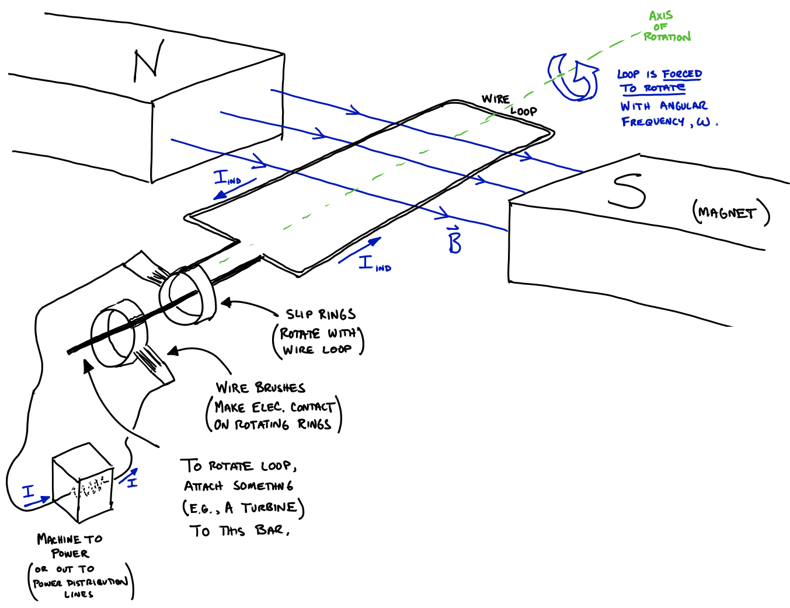
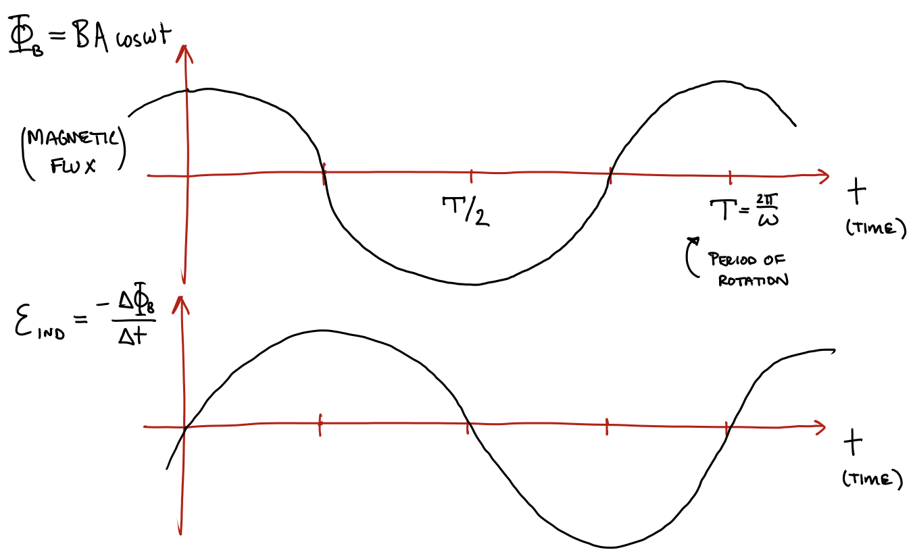
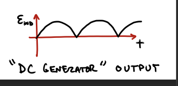
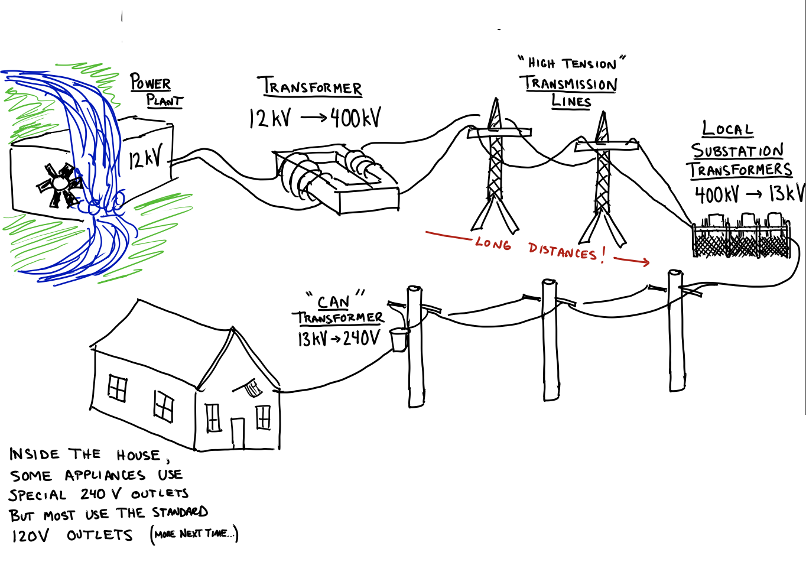
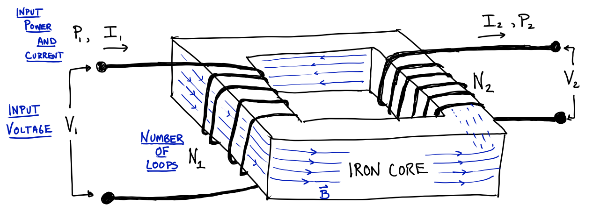

# Applications of Induction: Generators & Transformers

## Inductors and Inductance in Circuits

We will not spend much time on inductors, or the AC (alternating current) circuits where they are important, but you should know that there is a circuit element called an inductor which is simply a coil of wire.



Qualitatively, we can understand that there will be a potential difference across the inductor
```math
\Delta V_L = \Delta V_{ab}
```
Whenever the current through the coil is *changing*. The potential difference will be due to the induced EMF (caused by the changing $\vec{B}$ field in the coil, caused by the changing current).

Closing the switch in the circuit above causes an increasing current, which cases an increasing $\vec{B}_\text{coil}$ which causes an oppositely-pointed $\vec{B}_\text{ind}$.



Opening the switch causes the current to decrease, and a  decreasing current causes decreasing $\vec{B}_\text{coil}$ which causes $\vec{B}_\text{ind}$ in the same direction as the original field:



We define the *inductance* (or "self-inductance"), $L$, of an inductor as the constant of proportionality between magnetic flux through the coil and the current passing through the coil:
```math
\Phi_B = L I
```
From here we can determine the potential difference across an inductor. Find the "rate" of the above definition (change wrt time):
```math
\begin{align}
\frac{\Delta \Phi_B}{\Delta t} &= L \frac{\Delta I}{\Delta t} \\
\varepsilon_{\text{ind}} &= L \frac{\Delta I}{\Delta t}\\
\Delta V &= L \frac{\Delta I}{\Delta t}
\end{align}
```
Note that $L$ doesn't change in time; it is a constant.

So we see that the potential difference depends on the rate of change of the current in time.

Although we define $L$ in terms of $\Phi_B$ and $I$, the value actually depends only on the physical properties of the coil itself (e.g., $N_{\text{loops}}$, diameter, ...). This is similar to how, recall, the capacitance, $C$, and resistance, $R$, also depend only on the physical characteristics of the circuit element.

## Generators (and Motors)

A *generator* uses the principle of magnetic induction to create electrical power. It converts mechanical energy into electrical energy.

Although generators employ many loops of wire (to increases $\mathcal{E}_\text{ind} = N_\text{loops} \left| \frac{\Delta \Phi_B}{\Delta t} \right|$) the following simple *one-loop generator* shows all of the important ideas.



The rotation of the wire loop within a contant magnetic field causes a changing flux:
```math
\begin{align}
\Phi_B &= B A \cos \theta_{BA}\\
& = B A cos \left(\omega t\right)
\end{align}
```
where we show that the angle is constantly changing in time with $\theta(t) = \omega t$.

The changing flux cases an induced emf in the loop:
```math
\mathcal{E}_\text{ind} = \left| \frac{\Delta \Phi_B}{\Delta t} \right|
```
which drives a current. Note that the EMF is the slope (or "derivative") of $\Phi_B$ vs $t$ ... (see next part).

We can plot the flux and EMF as functions of time. We will combine Faraday's and Lenz's laws to say that:
```math
\varepsilon_{\text{ind}}(t) = - \frac{\Delta \Phi_B}{\Delta t}
```
where the negative is for the "opposes the change" part.

So we see that EMF is the opposite of the slope of $\Phi_B$ vs. $t$ at any time.



So the induced EMF (voltage) is sinusoidally oscillating with period $T = \frac{2\pi}{\omega}$. This means that the current induced, $I(t)$, is also oscillating. 

Thus, a generator produces alternating (AC) current.

You can't make a DC (direct current) generator that provides a constant voltage. But, you can make the EMF always positive by "flipping the leads" every half turn using a commutator (slip ring w/ slits).  See, e.g., [this site](https://farside.ph.utexas.edu/teaching/316/lectures/node91.html).



A motor is simply a generator in reverse. If you supply an alternating current to a wire loop in a magnetic field it will become an oscillating magnetic dipole, constantly flipping to align with the magnetic field.

## Transformers and Power Distribution

The second best thing about AC power (the first being that it is so easy to generate) is that it is easy to change, or transform, the voltage.

This turns out to be crucial for power distribution: we generate power where it is convenient (e.g., a waterfall) and we want to lose as little power as possible ($P_{loss} = I^2R$) in the wires to the consumer.



Inside our homes some appliances use special 240V outlets but most use the standard 120V outlets. This is the final voltage we see.

The voltage is dramatically increased (400KV!) for the long-distance transmission to reduce the current flow. For a constant transmitted power, $P_0$:
```math
P_0 = IV \Rightarrow I = \frac{P_0}{V}
```
So we see that increasing $V$, decreases $I$.

The voltage in AC power is transformed using magnetic induction. The *transformer* is two coils, with different numbers of loops, either nested together or connected via an iron core:



- An alternating current at the input voltage}, $V_1$, creates a changing magnetic field in the coil with $N_1$ loops.
- The ferromagnetic iron core transmits that magnetic field around to the coil with $N_2$ loops.
- The changing magnetic field within the second coil induces an EMF in that coil, producing an alternating current with an output voltage, $V_2$.

We can determine the relationship between $V_1$ and $V_2$ by assuming that the magnetic flux is the same throughout the iron core:
```math
\begin{align}
\Phi_{B_1} &= \Phi_{B_2} \\
\rightarrow \quad \frac{\Delta \Phi_{B_1}}{\Delta t} & = \frac{\Delta \Phi_{B_2}}{\Delta t} \\
\frac{\mathcal{E}_1}{N_1} &= \frac{\mathcal{E}_2}{N_2} \\
& \rightarrow \quad V_2 = \frac{V_1}{N_1}
\end{align}
```
where we have used that 
- If the flux is the same at all times, then the rate-of-change of flux is also the same at all times.
- The induced EMF is $\mathcal{E}_\text{ind} = N_\text{loops} \frac{\Delta \Phi_B}{\Delta t}$.

And therefore we see that the ratio of the number of loops determines $V_2$ in terms of $V_1$.


