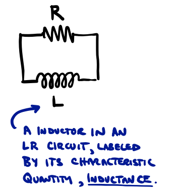
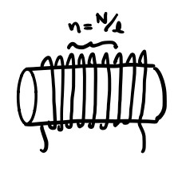
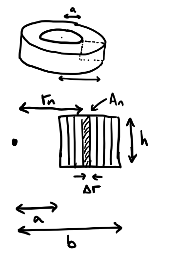
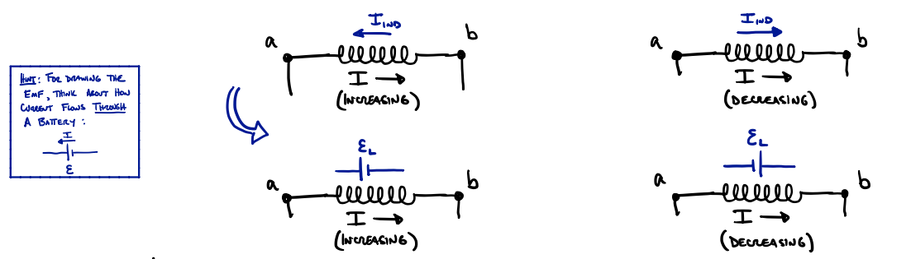
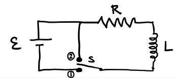
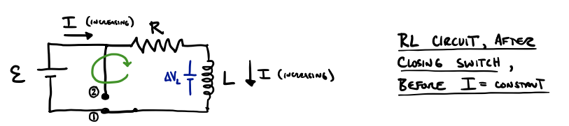
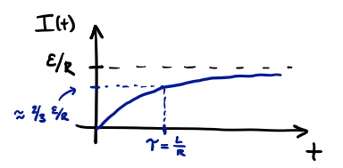
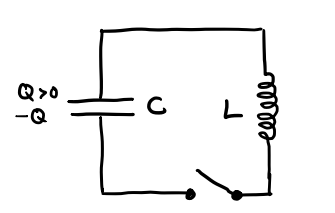
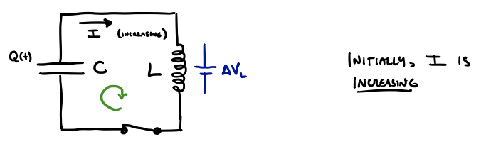
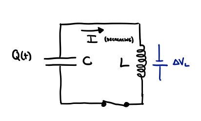

# Inductors, RL and RLC Circuits

## Introduction and Overview

Last time, we introduced the idea of induction; so-called "Mutual Induction" of two coils, and "Self-Induction" of a single coil. We showed how the former led to devices called transformers which are workhorses of our AC power network. Today we will focus on the latter, in particular the use and function of inductors in a circuit.

In particular we will consider the dynamics of current flow in circuits with both inductors and resistors (RL circuits) and those with capacitors as well (RLC circuits). This will provide necessary background for the next lecture where we attach an AC voltage source to such circuits and study AC circuits in their full glory.



In addition to the dynamics (i.e., current flow over time) of these circuits, we will also focus on their purpose: energy storage devices. Just as a charged capacitor stores energy in its electric field (which could be released and utilized by discharging it), an inductor stores energy in its magnetic field.

## Review of Inductors

An inductor is simply a coil of wire used as an element in a circuit. If current in the coil is constant, then there is a constant magnetic field in the coil. But if the current is changing, then its own magnetic field strength is changing, and, by Faraday's Law, there is an additional induced current, driven by the induced EMF, which acts to oppose the change in magnetic flux in the coil.

Because the magnitude $|\mathbf{E}|$, and therefore magnetic flux $\Phi_B$, is proportional to current, we expect the induced EMF in the coil to be proportional to the change of the current, i.e., from Faraday's Law (treating the coil's own magnetic field as the "external field" ) we find the **defining equation of inductance**:
```math
\mathcal{E}_{\text{ind}} = - \frac{d\Phi_B}{dt} \propto \frac{dI}{dt} \quad \rightarrow \quad \mathcal{E}_{\text{ind}} = - L \frac{dI}{dt}
```
where the constant of proportionality, $L$, is called the inductance of the coil. We see that it has units of:
```math
[\mathcal{E}] = [L] \left[\frac{dI}{dt}\right] \quad V = \left[\frac{Vs}{A}\right] \quad \text{hence}, \quad [L] = \frac{Vs}{A} = H, \text{"Henry"}
```

In the following, we will show that inductance, just like capacitance, depends only on the physical properties of the coil (its geometry and windings), and not, e.g., on the current flowing through it.

### How to calculate inductance of an inductor

We can write the defining equation of inductance in terms of magnetic flux using Faraday's Law:
```math
\begin{align}
\mathcal{E}_{ind} &= L \frac{dI}{dt}\\
\frac{d}{dt} (N\Phi_B) &= L \frac{dI}{dt}
\end{align}
```
We can then integrate this equation with respect to time (dropping abs. values):
```math
\begin{align}
\int \frac{d}{dt} (N\Phi_B) dt & = L \int \frac{dI}{dt} dt \\
N\Phi_B &= LI + C \\
N\Phi_B &= LI 
\end{align}
```
where, in the last step, we can assume that when $I(t) = 0$, the flux is also $\Phi_B(0) = 0$, so the integration constant becomes $C = 0$.

Therefore we can express inductance as a ratio of flux to current at any moment of time:
```math
L = \frac{N\Phi_B}{I}
```
(Note that this does not mean that the inductance depends on current; we know that \( \Phi_B \) is proportional to \( I \), so it cancels in this equation.) This equation allows us to find \( L \) for some common coil types.

### Inductance of a long solenoid



To use the above equation, we recall the expression (derived using Ampère's Law) for the magnetic field of a solenoid with \( n \) windings per unit length:
```math
B_{solenoid} = \mu_0 n I = \frac{\mu_0 n I}{l}
```
Therefore
```math
\Phi_B = BA = \mu_0 n I A \Rightarrow L = \frac{N\Phi_B}{I} = \frac{\mu_0 N^2 A}{l}
```
And we see that the inductance per unit length is:
```math
\frac{L_{solenoid}}{l} = \mu_0 n^2 A
```

### Inductance of a (rectangular cross-section) toroidal solenoid



Recall that the magnetic field of a toroidal solenoid depends only on \( r \), the distance from its center, \( B_T \propto \frac{1}{r} \). To calculate the flux here, we must do an integral (choosing a rectangular cross-section simplifies this):
```math
\Phi_B = \sum_{i=1}^{N} B_{A_n} = \sum_{i=1}^{N} \frac{\mu_0 n I}{2\pi r} A \Rightarrow \Phi_B = \int_a^b \frac{\mu_0 n I}{2\pi r} dr
```
So we find that
```math
\Phi_B = \frac{\mu_0 n I}{2\pi} \ln \left(\frac{b}{a}\right) \Rightarrow L = \frac{N\Phi_B}{I} = \frac{\mu_0 N^2}{2\pi} \ln \left(\frac{b}{a}\right)
```

## Basic Methods of L-Circuit Analysis

Before considering LR, LC, RLC, and (next time) AC circuits, we need to understand how the potential difference changes across an inductor. This is because we will analyze these circuits just as we did RC circuits:

1. Write down Kirchhoff's loop rule (potential differences around the loop).
2. Write the equation in the form of a differential equation (all will be linear, first- or second-order ODEs).
3. "Solve" the differential equation, either by knowing the solution already, or guessing and checking.

From the previous discussion, we know that the potential difference across an inductor is:
```math
\Delta V_L = \mathcal{E}_{\text{ind}} = L \frac{dI}{dt}
```
where $I$ is the current passing through it. But what is the sign? $\Delta V \lessgtr 0$? The answer comes from Lenz's Law: if a current is increasing, then the induced EMF will point opposite to it (drive current in the opposite direction); $\Delta V$, if the current is decreasing, the induced current will point in the same direction. We can indicate the direction of potential difference using the EMF symbol:



Looking at these two cases separately, we see that, if we go with the current:
```math
\Delta V_{(a-b)} = -\mathcal{E}_L = -L \frac{dI}{dt} \quad \quad \text{($I$ increasing)}
```
and 
```math
\Delta V_{(a-b)} = +\mathcal{E}_L = +L \frac{dI}{dt} = L \left( -\frac{dI}{dt} \right) = -L \frac{dI}{dt} \quad \quad \text{($I$ decreasing)}
```

So, we can use $\Delta V_L = -L \frac{dI}{dt}$ when going in the direction of current flow, regardless of whether current is increasing or decreasing.

## R-L Circuit

We consider a circuit with a DC EMF, a resistor, and an inductor. We'll include a switch that allows for either (1) current flow from the battery, or (2) residual current flow only in R & L:



Immediately after putting the switch in position (1), we have the following current flow, and resulting $\Delta V$:



Therefore, the potential differences satisfy:
```math
\begin{align}
|\Delta V| - |\Delta V_R| - |\Delta V_L| &= 0 \\
\mathcal{E} - IR - L \frac{dI}{dt} &= 0 \\
\end{align}
```
So we have:
```math
\begin{align}
\frac{dI}{dt} &= \frac{\mathcal{E} - IR}{L} \\
\frac{dI}{dt} &= -\frac{R}{L} (I - \frac{\mathcal{E}}{R}) 
\end{align}
```
Recall that we encountered a similar equation for charging a capacitor. We can make a substitution:
```math
u := I - \frac{\mathcal{E}}{R} \quad \rightarrow \quad \frac{du}{dt} = \frac{dI}{dt} 
```
which we can plug in to find:
```math
\frac{du}{dt} = -\frac{R}{L} u \Rightarrow u(t) = A e^{-\frac{R}{L}t}
```
And therefore:
```math
I(t) = \frac{\mathcal{E}}{R} + Ae^{-\frac{R}{L}t}
```
Applying our initial conditions, $I(0) = 0$, we solve for the integration constant, $A$:
```math
\begin{align}
I(0) &= \frac{\mathcal{E}}{R} + Ae^{-\frac{R}{L} \cdot 0}\\
0 &= \frac{\mathcal{E}}{R} + A \\
& \rightarrow \quad A = - \frac{\mathcal{E}}{R}
\end{align}
```
So, finally, we have:
```math
I(t) = \frac{\mathcal{E}}{R} \left[ 1 - e^{-\frac{R}{L}t} \right]
```
which looks like:



The current approaches the steady state value w/ time constant $\tau = \frac{L}{R}$.

## LC Circuits

Let's consider a circuit with just an inductor and a capacitor. We'll assume that the capacitor is charged to some $Q$ and that the switch is open:



Then, when the switch is closed, current will flow from the positively-charged plate, through the inductor, to the negatively charged plate.



So, initially, at least, we can write
```math
\begin{align}
+|\Delta V_C| - |\Delta V_L| &= 0 \\
\frac{Q}{C} - L \frac{dI}{dt} &= 0
\end{align}
```
We can write the current in terms of the charge on the capacitor:
```math
i(t) := \frac{dQ}{dt} = -I \quad \text{(when capacitor is discharging)}
```
where, recall, we made the same definition in our analysis of RC circuits. So, the equation above can be written:
```math
\frac{Q}{C} - L \frac{d}{dt}(-\frac{dQ}{dt}) = 0 \Rightarrow \frac{d^2Q}{dt^2} = -\frac{1}{LC} Q
```

At some point the current should slow (starts at zero, finite change on the capacitor). With $\frac{dI}{dt} < 0$, the direction of the induced EMF will change:



Then we have:
```math
\begin{align}
+|\Delta V_C| + |\Delta V_L| &= 0 \\
\frac{Q}{C} - L \frac{dI}{dt} &= 0 \\
\frac{Q}{C} - L \frac{d}{dt}(-\frac{dQ}{dt}) &= 0 \\
\Rightarrow \frac{d^2Q}{dt^2} &= -\frac{1}{LC} Q 
\end{align}
```
So, we see that the equation remains the same! (Also note that, with $dI/dt = 0$, the loop rule only makes sense if $Q \le 0$!)

Therefore, regardless of the sign of $\frac{dI}{dt}$, we have
```math
\frac{d^2Q}{dt^2} = -\frac{1}{LC} Q
```


